# Design and usability audit

**What this is.** A look at SEO Studio through the eyes of a CXO opening it for the first time. For every screen we asked three questions:

1. Is it obvious what this screen is for?
2. Are the numbers easy to read and trust?
3. Does it feel like one product, or like separate tools stitched together?

The body of this report is written for SEO people, not developers. The technical detail is in [Appendix B](#appendix-b--notes-for-the-developers).

---

## The short version

| Question | Verdict |
|---|---|
| Is it obvious what each screen does? | **Mixed** |
| Is the data easy to read? | **Mixed** |
| Does it feel like one product? | **Unclear — it feels like several** |

**What works.** Three screens are genuinely good. The Home dashboard's executive summary ("Action needed… start with these 3"), the crawl report's issue pages ("what the check looks for / the fix") and the Content Architect report all explain themselves in plain English. That is the standard the rest of the app should meet.

**What gets in the way.** The client you pick at the top of the screen is ignored by most tools. Content Research, Competitor Analysis, Content Writer, Location Pages and the Knowledge Base each have their own client list. Screens are built from three different kits of buttons, cards and tables, and a further 19 screens hand-build their own. So page widths, titles, buttons, colours and loading styles change as you move between tools.

**What damages trust.** Numbers disagree from screen to screen:
- Pages crawled is 1,137 on Home but 1,356 on the crawl report.
- One line reads "2,140 of 1,136 pages".
- A 3/100 score carries a green "Healthy" badge.
- A site with an 11-second mobile load time is marked "Passed".

Some screens print raw text such as "[object Object]" and "1 of undefined crawled". Others show messages meant for engineers, such as "Seed Gentle Dental data" and "stored in plaintext on disk".

**The single biggest problem.** One client, one set of numbers, one look. Until the header's client choice drives every tool and every screen shares one kit, a first-time CXO will read SEO Studio as a bundle of experiments rather than one product. Eleven of the sixteen menu items carry an "Internal", "Beta" or "Testing" badge, which says the same thing out loud.

---

## How we tested

- **What we looked at:** this branch (`unified-fast-aivisibility`, commit a670911 plus uncommitted work), on 25 Sep 2026. It includes the new Content Writer, which is not on the live site yet.
- **Screen sizes and themes:** a 1440 × 900 laptop screen in the default dark theme, then spot checks in the light theme and at phone width (390 px). We also loaded pages on a slow connection to see the loading states.
- **Data:** real client data (Riccobene, Acalvio, Gentle Dental), read from the production database through a local copy of the app. That copy was locked to **read-only**, so nothing could be changed or started.
- **What we deliberately did not click:** Run, Re-run, Save, Delete, Export, Create or Recrawl. We also didn't step forward through any wizard.
- **Screens that tried to start work on their own:** the safety lock blocked four requests, of two kinds, that pages sent just by being opened: three On-Page audits from SEO & GEO Audit and one Hub & Spoke refresh from Content Architect. Those appear below as findings.
- **The read-only lock held:** the database refused all 373 writes the app attempted, 372 of them the app's own "record this page view" activity log.
- **What we could not see:**
  - Results screens of tools that keep no history: Keyword Research, Content Research, Article Recommendation, both Article Enhancers, Image Alt Audit and Content Enhancement. Seeing them means running (and paying for) a job.
  - A crawl or AI job while it is running.
  - The brand-new-workspace first screen, because we have only one workspace.

  Those were judged from their start screens and from the code. Issues found only in the code are marked **(seen in the code)**.
- **Local-setup caveat:** one AI Visibility warning ("ANTHROPIC is not configured") appeared because an AI key was missing from our local setup. We report the wording, not the missing key.
- **How the skills were used:**
  - **webapp-testing:** visiting and screenshotting every screen.
  - **frontend-design:** judging layout, type, colour and wording.
  - **pick-ui-library:** checking shared components.
  - **review-animations and find-animation-opportunities:** checking motion and missing feedback.

## What the priorities mean

- **High:** a first-time user gets stuck, misreads the numbers, or stops trusting the screen.
- **Medium:** slows people down, or looks different enough to feel like another product.
- **Low:** polish.

---

## Across the whole app

The frame around every screen: menu, header, client picker, and the look and behaviour that should be shared.

| ID | Screen | What's wrong | Why it matters to you | Priority |
|---|---|---|---|---|
| APP-1 | Every tool | The client picked in the header is ignored by most tools. Content Research, Competitor Analysis, Content Writer, Location Pages and the Knowledge Base each keep their own client list, and Keyword Research asks for nothing client-related at all. | You choose "Riccobene" and then choose it again, or work on the wrong client without noticing. This is the clearest sign the tools are not one product. | High |
| APP-2 | Every screen | Screens are built from three different "kits" of buttons, cards, tabs and tables, and 19 screens use none of them. Page widths, title styles, button styles and spacing change from tool to tool. | Moving between tools feels like moving between different apps. It also makes every fix slower, because each tool has to be fixed separately. | High |
| APP-3 | Side menu | 11 of 16 menu items carry an "Internal", "Beta" or "Testing" badge. | To a CXO this reads as an unfinished product, and the badges no longer tell the team anything. | High |
| APP-4 | Side menu | The tool list is hidden by default. A first-time user sees only an icon, and the Home screen has no links to the tools. | A new user cannot see what the product does or where the tools are. | High |
| APP-5 | Several screens | Two screens start paid background work just by being opened. SEO & GEO Audit starts a PageSpeed-based On-Page audit. Content Architect starts a Hub & Spoke refresh. The code shows Competitor Analysis does the same with PageSpeed. | Looking at a report should never spend money or change what colleagues see. People will stop browsing freely once they learn this. | High |
| APP-6 | Header | The page title in the header says "SEO Studio" on Projects, Workspaces, Run history, Admin, Robots Monitor and Content Enhancement, instead of the page name. | You lose your sense of where you are. | Medium |
| APP-7 | Header | The Semrush balance is always shown in alarm red. Market Potential shows a different balance ("SEMrush: 200,000 credits" against "Semrush 891,950 units"), with different spelling and units. | Red suggests something is wrong when nothing is. Two balances make people doubt both. | Medium |
| APP-8 | Every screen | Loading looks different everywhere: a blank dark screen, grey skeleton blocks, the words "Loading crawl…", or a wrong "no data" message (see CMP-3 and CRW-3). On a slower connection the whole app is a **blank dark screen for 2–3 seconds** with no logo or progress. | A blank screen looks broken. A wrong "nothing here" message makes people think their data is gone. | High |
| APP-9 | Every screen | Small grey text (captions, labels, units) is too faint to read comfortably in the dark theme. On average 12–13 pieces of text per screen fail the standard contrast check, and some screens fail 30–40. | Hard to read in a meeting room or on a laptop in daylight. It is also an accessibility failure. | Medium |
| APP-10 | Every screen | There is no type scale: we counted 32 different text sizes, from 9 px to 64 px. About 1 in 5 text elements uses a code-style (monospace) font for labels and numbers, and tracked-out ALL-CAPS labels sit above most sections. | The pages look busy and "technical". Nothing tells you what is most important. | Medium |
| APP-11 | Many screens | Engineer language leaks into the product: • database table names on Admin • raw ID codes in Run history and recent-runs lists ("project 8f6473f6-3991-…") • raw data dumps in the Run history drawer • "Failed to fetch" • "[object Object]" • "1 of undefined crawled" • "Seed Gentle Dental data" • "stored in plaintext on disk". | Each one tells a CXO the product isn't finished, and none of them help an SEO person. | High |
| APP-12 | Every tool page | Each tool has a "Recent runs" panel at the bottom, but runs are listed by raw ID or keyword, and in most tools there is no way to reopen a past result. | People expect "recent runs" to take them back to their work. | Medium |
| APP-13 | Whole app | If any screen hits an unexpected error, the whole app goes blank; there is no "something went wrong" screen. **(seen in the code)** | A single bug on one tool looks like the whole product is down. | Medium |
| APP-14 | Notifications | Pop-up messages (toasts) disappear after 5 seconds even when they report an error. Screen readers don't announce them, and crawler errors show an "info" icon instead of an error icon. **(seen in the code)** | Errors are easy to miss. The Robots Monitor tool uses a second, different style of pop-up. | Medium |
| APP-15 | Whole app | Destructive actions happen with no "are you sure?" step: Stop crawl, Remove workspace member, Revoke admin, Delete a Content Architect project, reject a location page, and the bulk "Set all N shown to…" in the crawl report. **(seen in the code)** | One mis-click stops a long crawl or removes a colleague. | Medium |
| APP-16 | Keyboard use | With the side menu hidden, pressing Tab still moves through its invisible search box and links. | Keyboard users lose track of where they are. | Low |
| APP-17 | Phone width | At phone width the header runs off the screen (the balance and account buttons are cut off) and long page titles overflow sideways. | Minor for a desktop tool, but a CXO opening a shared link on a phone gets a broken first impression. | Low |
| APP-18 | Light theme | The light theme is consistent and readable, better than dark for contrast. Dark is the default, and the dark theme has one visible bug: the Knowledge Base editor is a bright white box (KB-4). | — | Low |
| APP-19 | Motion | Almost nothing animates, which is right for a working tool. What does animate is sometimes wrong: • the side menu resizes the whole page as it opens • progress bars and score rings re-play every time you switch tab • pop-ups and dialogs vanish instantly with no exit • "reduce motion" settings are respected in only two places | Small, but it adds to the "not quite finished" feel. The details are in Appendix B. | Low |

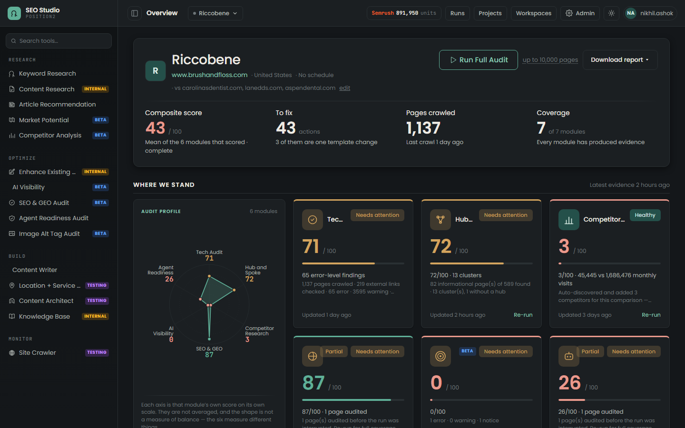
*With the menu open, most tools carry an Internal, Beta or Testing badge. By default the menu is hidden, and a new user sees only the icon at top left.*

*On a slower connection, the first two to three seconds are a blank dark screen.*

---

## Home (Overview dashboard)

**What it's for:** the client's scorecard: an overall score, six module scores and an executive summary.
**First impression:** the right idea, and the executive summary is the best writing in the app. But the most useful part is below the fold, and the badges contradict the scores.

| ID | Screen | What's wrong | Why it matters to you | Priority |
|---|---|---|---|---|
| HOME-1 | Module cards | The status badges don't match the scores. Competitor Research scores **3/100** in red but is badged **"Healthy"** (2/100 "Healthy" on Acalvio). Hub & Spoke 63 is "Healthy" while Tech Audit 70 "Needs attention". SEO & GEO 87 (green, called "Good" on its own page) says "Needs attention". | The first thing a CXO reads is contradictory. They will stop trusting every badge. | High |
| HOME-2 | Top of page | "43" appears twice with different meanings: a composite score of 43/100 and 43 actions to fix. | It looks like a mistake, and people repeat the wrong number. | Medium |
| HOME-3 | Top of page | The coverage figures disagree: "7 of 7 modules" at the top, "6 modules" in the audit profile, "Mean of the 6 modules that scored". Acalvio's coverage line even mentions a module hidden from the menu ("AI Visibility (scraped) not run yet"). | Coverage should be the simplest number on the page. | Medium |
| HOME-4 | Module cards | At a normal laptop width, card titles are cut off ("SEO & …", "Agent …"). With the menu open, even "Tec…" and "Hub…" are cut. | You can't tell which module you're looking at. | Medium |
| HOME-5 | Executive summary | The plain-English summary ("Action needed… start with these 3") sits at the very bottom, below a radar chart that needs a paragraph of explanation. | The part a CXO needs most is the part they may never scroll to. | High |
| HOME-6 | Card text | Card descriptions are in shorthand: "3/100 · 45,445 vs 1,686,476 monthly visits", "82 informational page(s) of 589 found · 13 cluster(s), 1 without a hub". | Meaningful to the person who built it, not to a first-time reader. | Medium |
| HOME-7 | Pressing Re-run on one card | The whole dashboard goes blank to grey placeholders while one module reruns. **(seen in the code)** | It looks as if everything was lost. | Medium |
| HOME-8 | Run Full Audit | After you confirm, nothing on the page changes until the crawl bar appears. The "Full audit complete" message can appear while modules are still running. **(seen in the code)** | People click twice, or believe work has finished when it hasn't. | Medium |
| HOME-9 | While loading | The header says "Add a client" for a moment on every visit, until your clients have loaded. | Brief, but it tells a new user they have no clients. | Low |

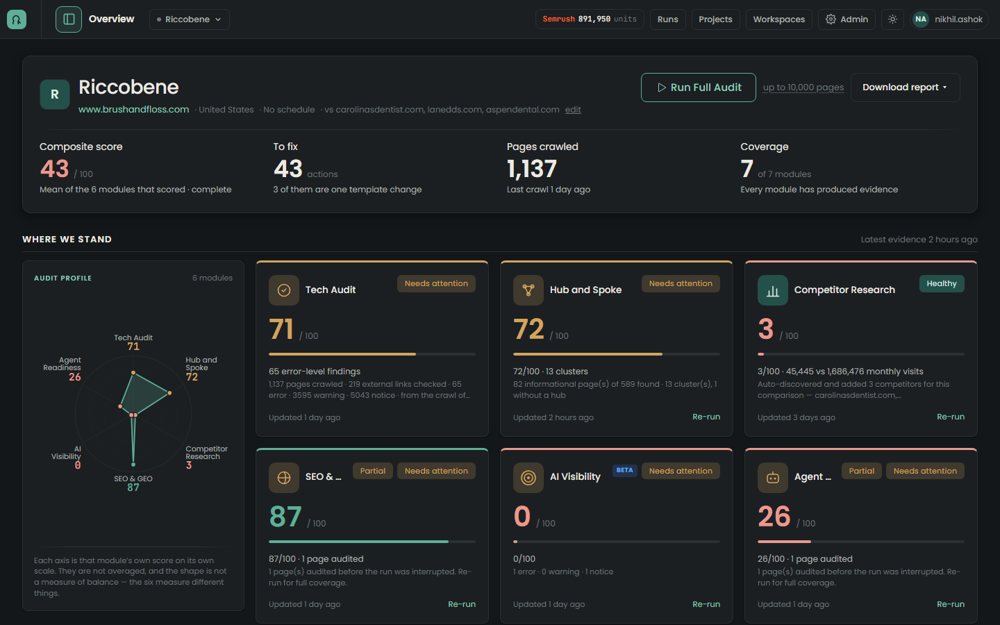
*"Competitor Research 3/100: Healthy". Card titles are cut off, and "43" appears twice.*

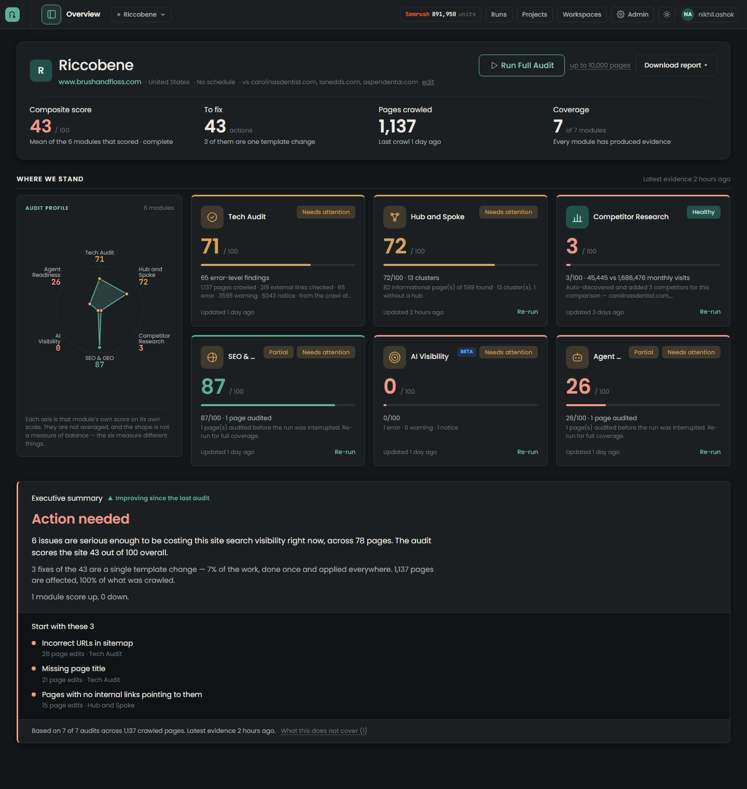
*The clear executive summary is at the bottom of the page.*

---

## Projects, Workspaces, Run history, Admin

**What they're for:** managing clients, the team, the record of what ran, and platform settings.
**First impression:** functional, but each page has its own width and layout, and the text is written for engineers.

| ID | Screen | What's wrong | Why it matters to you | Priority |
|---|---|---|---|---|
| ACC-1 | Projects | Long paragraphs of internal explanation ("primary domain read from project_domains", three sentences on keyword placement). The "Save changes" buttons look disabled even when they are the main action. | Setting up a client is the first job, and it reads like documentation. | Medium |
| ACC-2 | Run history | "Ran on" shows raw ID codes ("project 8f6473f6-…", "client client_mu6uey…"). Clicking a run shows a raw data dump (input and output as code). | The history is unreadable exactly when you need it: to see what a colleague ran. | Medium |
| ACC-3 | Run history, Admin | Figures are shown in a code-style font with ALL-CAPS labels. Times include seconds ("9/25/2026, 12:51:20 PM") on some screens and "2h ago" on others. | Inconsistent, and harder to scan. | Low |
| ACC-4 | Admin | The database capacity card says "594 MB of 512 MB — 100% used". It is actually 116%, and the table list uses internal names. | The warning matters (writes may start failing), but the numbers don't add up. | Medium |
| ACC-5 | Workspaces | "Remove" member is a red link with no confirmation step. **(seen in the code)** | One mis-click removes a colleague's access. | Medium |
| ACC-6 | All four | Four different page widths and left edges. | They feel like four separate admin tools. | Low |

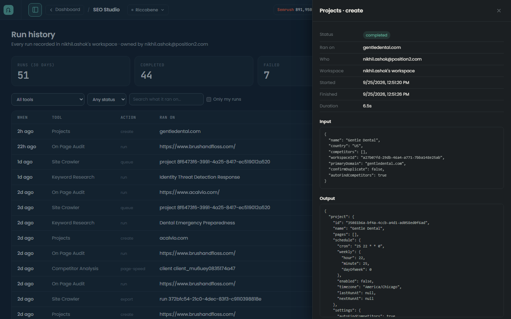
*A run's details are shown as raw data.*

---

## Keyword Research

**What it's for:** finding primary and secondary keywords for a seed topic.
**First impression:** the form is simple, but there's no title or explanation, and it ignores the client you're working on.

| ID | Screen | What's wrong | Why it matters to you | Priority |
|---|---|---|---|---|
| KW-1 | Start screen | No page title or one-line explanation. The screen opens straight onto a form. | A first-time user has to guess what they'll get. | Medium |
| KW-2 | Start screen | It doesn't use the client or domain chosen in the header. | The results aren't tied to the client, so they can't flow into other tools. | High |
| KW-3 | Recent runs | Past searches are listed but can't be reopened; results are not kept. | Close the tab and the shortlist is gone. | High |
| KW-4 | Buttons | "Start Research" looks grey and disabled. Other tools use a faded green for the same state. | One of three different "disabled" button styles in the app. | Low |

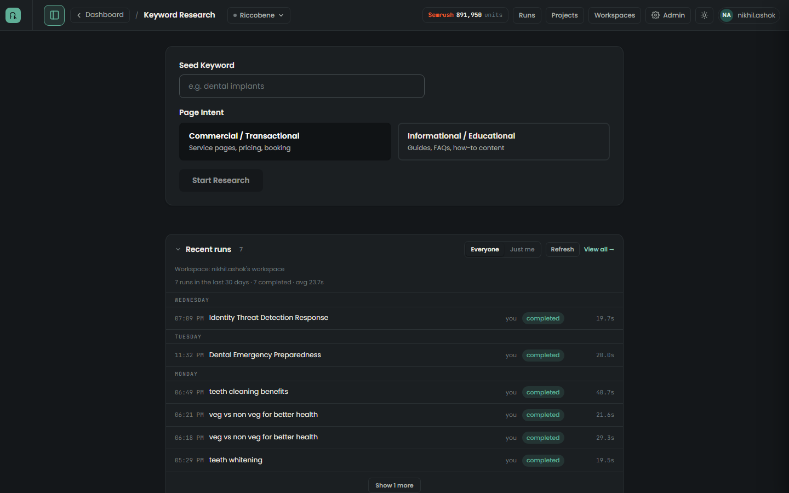

## Content Research

**What it's for:** building a content brief from the top 10 Google results.

| ID | Screen | What's wrong | Why it matters to you | Priority |
|---|---|---|---|---|
| CRS-1 | Start screen | It has its own "Brand: No client (generic)" picker, separate from the header's client. | A second client choice on the same screen as the first. | High |
| CRS-2 | Start screen | No title, a much wider form than its neighbours, and a faded "Research" button. | Looks like a different product from Keyword Research next to it. | Medium |
| CRS-3 | Progress steps | The step bar never shows "complete" after a run. If a run fails, every earlier step shows a green tick. **(seen in the code)** | You can't tell when it's finished, or that it failed. | High |

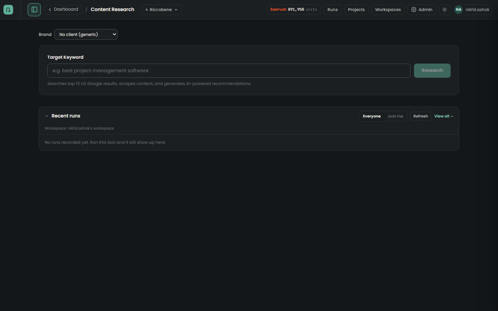

## Article Recommendation

**What it's for:** turning a keyword's top results into a full article brief.

| ID | Screen | What's wrong | Why it matters to you | Priority |
|---|---|---|---|---|
| ARC-1 | Start screen | No title or explanation. A one-field form in a wide empty card. | Unclear what you'll get or how long it takes. | Medium |
| ARC-2 | Recent runs | Past briefs can't be reopened. | Work is lost when the tab closes. | High |

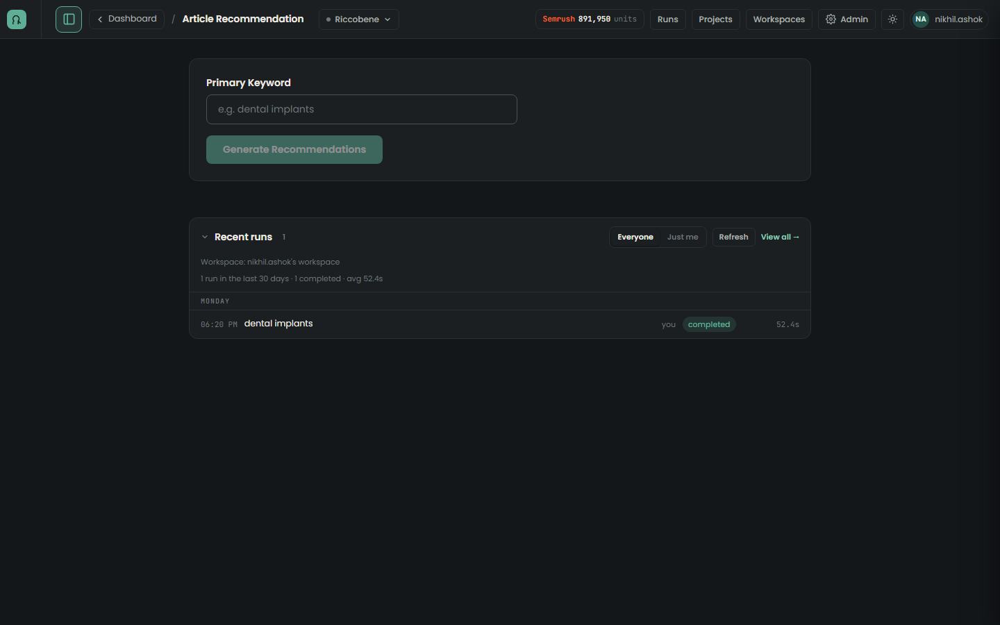

## Market Potential

**What it's for:** ranking nearby metros by search demand for a healthcare service.
**First impression:** one of the clearer tools. It has a title, a one-line purpose, numbered steps and "What you'll get".

| ID | Screen | What's wrong | Why it matters to you | Priority |
|---|---|---|---|---|
| MP-1 | Header area | Shows "SEMrush: 200,000 credits" while the header shows "Semrush 891,950 units". | Two different balances on one screen. | Medium |
| MP-2 | Title | "Healthcare Market Potential" with a code-style "MARKET INTELLIGENCE" label. The tool is healthcare-only, but the menu doesn't say so. | Users outside healthcare will be surprised. | Low |

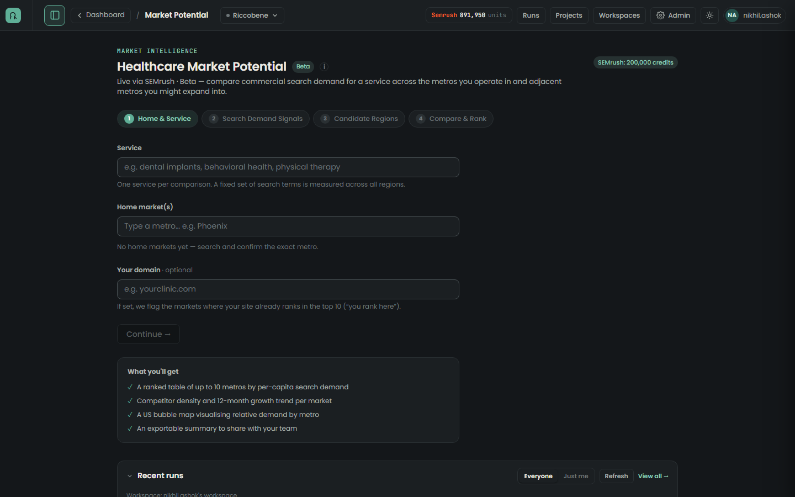

## Competitor Analysis

**What it's for:** comparing a client with its competitors on traffic, keywords, authority and page speed.

| ID | Screen | What's wrong | Why it matters to you | Priority |
|---|---|---|---|---|
| CMP-1 | Whole tool | It has its own client list and its own competitor list. Riccobene is compared with **gentledental.com** (another agency client) here, while the Home screen lists carolinasdentist.com, lanedds.com and aspendental.com. | The same client has different competitors in different tools, so the numbers can't be compared. | High |
| CMP-2 | Page Speed tab | Riccobene is badged **"CWV Passed"** next to a red mobile score of 31 and an 11.3-second load time. | A green "passed" next to failing numbers destroys trust in the whole tab. | High |
| CMP-3 | While loading | For several seconds the page says "No client selected — Add Client" and the client box says "No analysis for this project", before the data appears. | People think their analysis is gone and click "Add Client". | High |
| CMP-4 | Opening the tool | The code shows it starts a PageSpeed refresh automatically the first time you open a client. **(seen in the code)** | Opening a report shouldn't start work. | Medium |
| CMP-5 | Top of page | Four same-weight buttons (Manage Client, Add Client, Download Report, Run Analysis). A dense "LIVE DATA" notice about unit caps. Date format "9/11/2026, 4:21:19 PM". | The primary action and the key numbers compete with admin controls. | Medium |
| CMP-6 | Label | The page is labelled "OPTIMIZE" although the menu lists it under Research. | Small, but it adds to the "separate tools" feel. | Low |

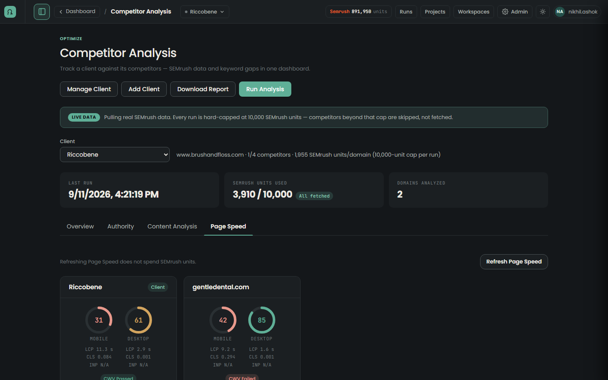
*"CWV Passed" under a mobile score of 31 and an 11.3-second load time.*

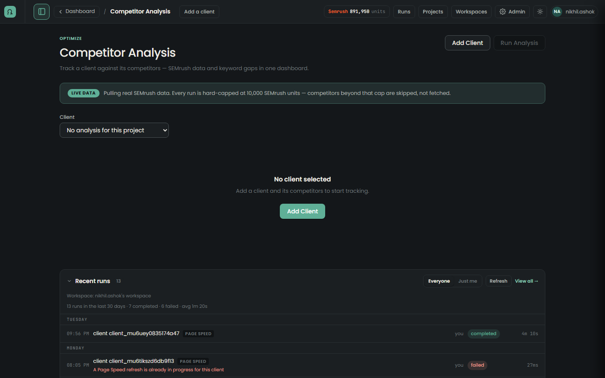
*While loading, the tool says no client is selected.*

---

## Enhance Existing Article, and Article Enhancer (lite)

**What they're for:** improving an existing article using AI and competitor pages.

| ID | Screen | What's wrong | Why it matters to you | Priority |
|---|---|---|---|---|
| ENH-1 | Start screen | Described in developer terms: "run 4 parallel model calls, synthesize concepts". The form asks users to pick AI model names and a knowledge-base file name. | An SEO person needs to know what they'll get, not how it works inside. | Medium |
| ENH-2 | Navigation | A second breadcrumb bar ("‹ All tools / Enhance Existing Article") sits under the app's own header. | Two sets of navigation on one screen. | Low |
| ENH-3 | Dependencies | The Knowledge Base's own health check shows both enhancers are missing a required knowledge-base file ("Not found in index"). | The tools may give weaker results, or fail, with no warning on their own screen. | Medium |
| ENH-4 | Menu | Two tools with near-identical names ("Enhance Existing Article" and a hidden "Article Enhancer"). | Unclear which one to use. | Low |

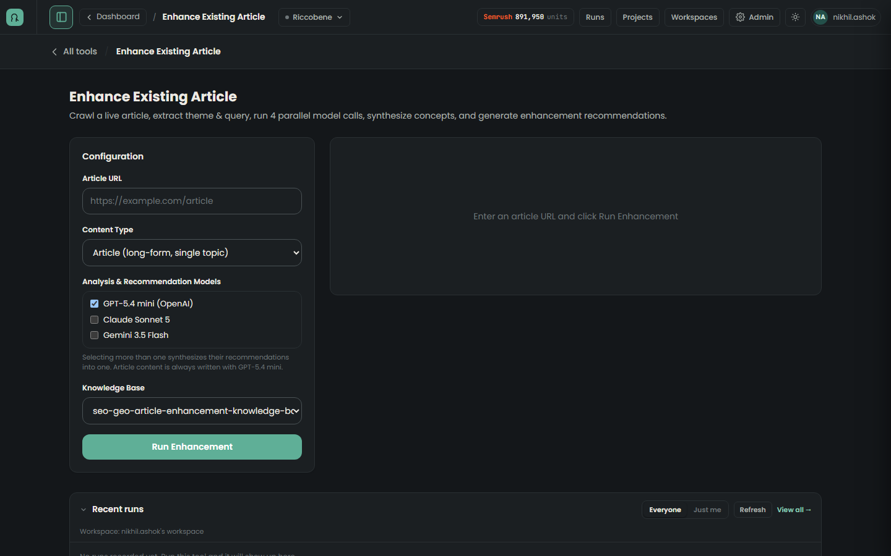

## AI Visibility

**What it's for:** measuring whether the brand is named in ChatGPT, Gemini and Claude answers.
**First impression:** a strong headline ("0/100 — Barely visible… comes up in 0.0% of the answers"), buried under warning banners and code-style numbers.

| ID | Screen | What's wrong | Why it matters to you | Priority |
|---|---|---|---|---|
| AIV-1 | Executive overview | Three notice banners stack up before the result, one of them a server-setup message ("ANTHROPIC is not configured on the server"). | The first thing a CXO reads is an engineer's warning, not the answer. | High |
| AIV-2 | Warnings | "Setup did not finish" warnings are shown in the normal accent colour, not a warning colour. **(seen in the code)** | Problems look like good news. | Medium |
| AIV-3 | Report tabs | Nine reports in five labelled groups ("START HERE / BRAND / DEMAND / SOURCES / EVIDENCE") with code-style counts, plus a "1 OF 9 ‹ Start / Insights ›" pager. Most figures use a code-style font. | Dense navigation for a first-time user. The numbers look like a terminal. | Medium |
| AIV-4 | Answers | Each answer shows "not named / did not search" chips and long rows of domain chips. | Hard to see the story ("who AI recommends instead of you"). | Medium |
| AIV-5 | Measuring | If you leave the page while a measurement runs (up to 40 minutes), coming back shows "Measure" again as if nothing is running. **(seen in the code)** | People start duplicate paid runs. | High |
| AIV-6 | Setup & runs | Each of the 10 questions has an "Edit" and a "Delete" button of equal weight. | Easy to delete a question by mistake. | Low |

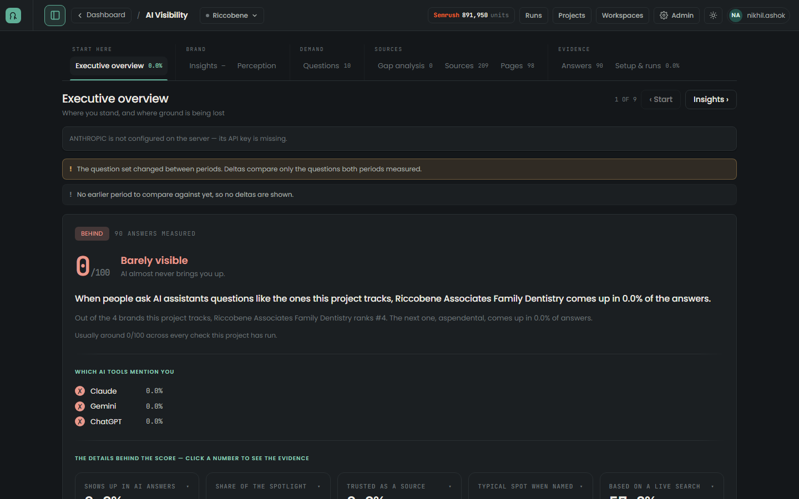
*The key message ("0/100, barely visible") comes after three warning banners.*

## AI Visibility (scraped), hidden from the menu

| ID | Screen | What's wrong | Why it matters to you | Priority |
|---|---|---|---|---|
| AIVS-1 | Title line | The subtitle prints **"[object Object]"**. | A visible programming error. | High |
| AIVS-2 | Whole tool | Same name ("AI Visibility") as the main tool, and still reachable by address and from Home's coverage line. | Two tools with one name, measuring differently. | Medium |

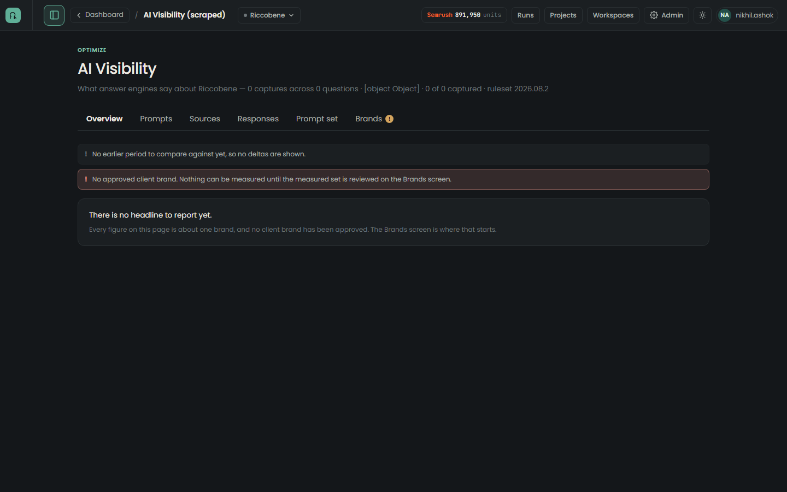

---

## SEO & GEO Audit

**What it's for:** scoring one page against 250+ SEO and AI-answer checks, with written advice.

| ID | Screen | What's wrong | Why it matters to you | Priority |
|---|---|---|---|---|
| SG-1 | Report bar | "Coverage: 1 of **undefined** crawled". | A visible programming error. | High |
| SG-2 | Opening the report | Opening it started an On-Page audit automatically (blocked during our test), and every page picked in the page picker starts another one. | Browsing a report spends money and changes run history. | High |
| SG-3 | Summary | The "priority verdict" is in specialist shorthand: "NAPEF gap (Availability, 0/2)", "openingHoursSpecification block with schema.org Day URIs", "GEO answerability". | The most important advice is the hardest to understand. | High |
| SG-4 | Summary | 87/100 is labelled "Good" here and "Needs attention" on Home. The tech view shows "Uncapped composite 87" and "AI Answer Readiness 4/10" next to each other. | Several scores for one page, each on a different scale. | Medium |
| SG-5 | Actions | "Analyze another page", "Re-run", "New audit" and "Dashboard" all sit together, and "Dashboard" duplicates the header's back button. | Unclear which one you want. | Low |

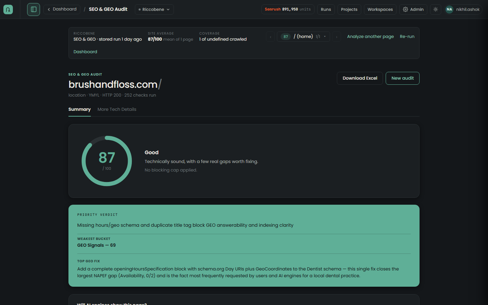
*"1 of undefined crawled", and the top fix written in specialist shorthand.*

## Agent Readiness Audit

**What it's for:** scoring how ready a site is for AI agents.

| ID | Screen | What's wrong | Why it matters to you | Priority |
|---|---|---|---|---|
| AGR-1 | Report bar | "Coverage: 1 of **undefined** crawled", the same error as SG-1. | A visible programming error. | High |
| AGR-2 | "Why this matters" | Presents an unsupported forecast as fact: "By 2027, agents will initiate the majority of commercial queries." | If a client asks for the source, we don't have one. It risks the agency's credibility. | High |
| AGR-3 | Summary | The executive summary is clear and client-ready. The score ring and report bar match SEO & GEO's, which is good consistency between these two tools. | — | — |
| AGR-4 | Shared summary page | Opening the share link without data shows only "Invalid or missing summary data". | A client clicking an old link sees an error page. | Low |

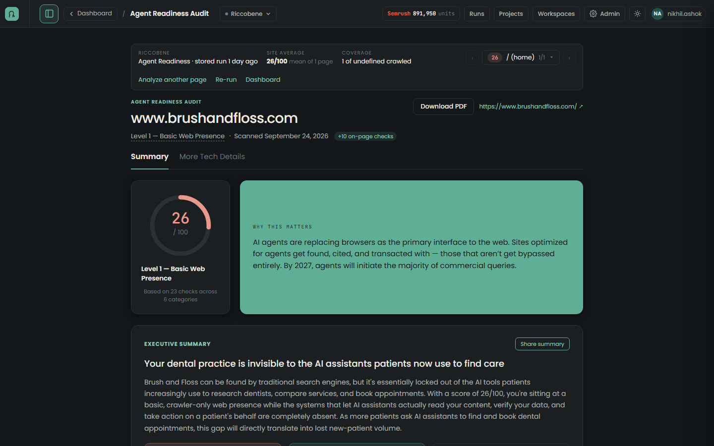

## Image Alt Tag Audit

| ID | Screen | What's wrong | Why it matters to you | Priority |
|---|---|---|---|---|
| IMG-1 | Start screen | No title or explanation. It opens straight onto a box of example URLs in a code font. | A first-time user can't tell what the audit produces. | Medium |
| IMG-2 | Results | Results are not kept: the workbook has to be downloaded before leaving. | Work is lost when the tab closes. | Medium |

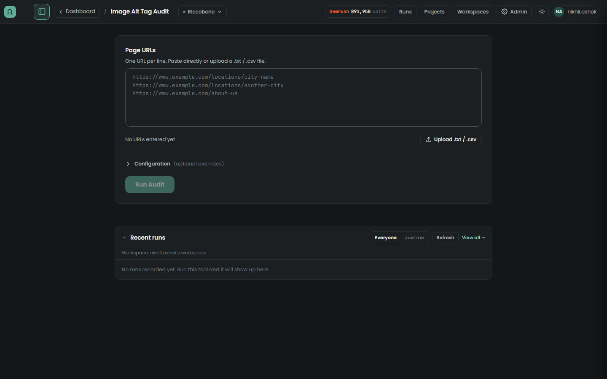

---

## Content Writer (new, not live yet)

**What it's for:** turning a keyword into a brief and then a draft, saved per project.
**First impression:** well laid out and clearly explained. The best of the "Build" tools.

| ID | Screen | What's wrong | Why it matters to you | Priority |
|---|---|---|---|---|
| CW-1 | Opening the tool | Opening an article silently switched the header's client from Riccobene to Acalvio. The page also has its own "Project" picker. | The next tool you open is on the wrong client. | High |
| CW-2 | Title | Labelled "CONTENT STUDIO", though the product is SEO Studio. | Muddles the product name. | Low |
| CW-3 | Toolbar | "Export JSON" sits next to "Export brief · DOCX". | JSON means nothing to an SEO person. | Low |
| CW-4 | Layout | Full-width and left-aligned, where neighbouring tools are centred. | Another page layout. | Low |

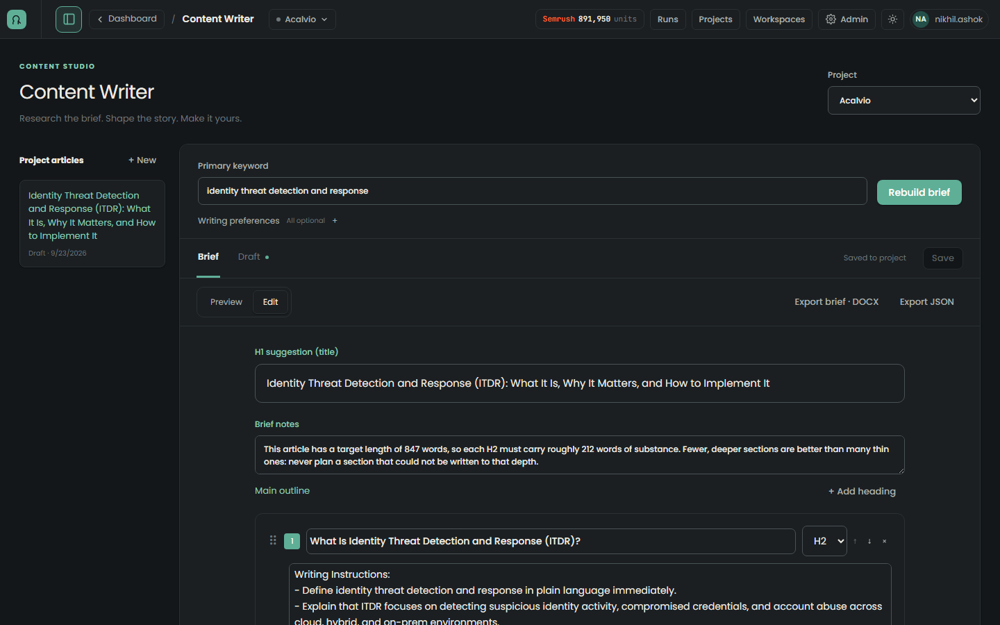

## Location + Service Pages

**What it's for:** building approved, ready-to-publish location pages for a client.
**First impression:** this is three separate client-specific tools, not one tool.

| ID | Screen | What's wrong | Why it matters to you | Priority |
|---|---|---|---|---|
| LOC-1 | Landing page | The menu item "Location + Service Pages" opens "Gentle Dental Pages", with hard-coded client tabs (Gentle Dental, Clear Behavioral Health, Neuro Wellness Spa). It ignores the header client. | It looks like a tool built for one client. Other clients can't use it. | High |
| LOC-2 | All three wizards | Each client has a different wizard: 4 steps or 5, different step names, a different back button ("← Dashboard", "← All Gentle Dental Pages", "← Module home"), and heavier headings than the rest of the app. | Three products under one menu item. | High |
| LOC-3 | Wizards | Both wizards open on "Client not found." with engineer actions ("Seed Gentle Dental data", "Sync client list", "Seed Neuro Wellness Spa"). | The tool looks broken, and a user shouldn't be asked to "seed" anything. | High |
| LOC-4 | Lists | "No pages yet" tables with no guidance beyond "Generate one from the wizard". | Empty screens should say how to start. | Low |

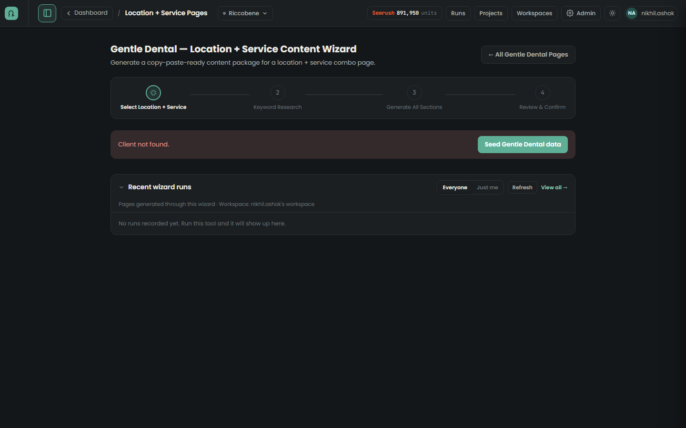
*"Client not found", next to a "Seed Gentle Dental data" button.*

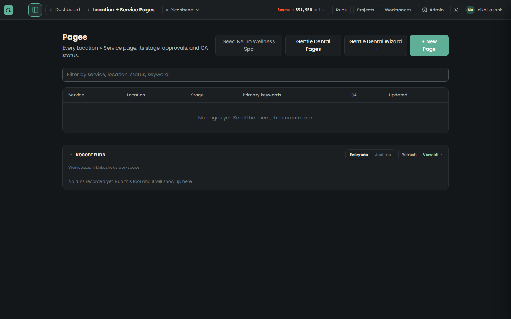

## Content Architect

**What it's for:** mapping a site into topic clusters, hubs and gaps.
**First impression:** the report is one of the best-explained screens ("How the site's topics are organized"). The start screen failed in our test.

| ID | Screen | What's wrong | Why it matters to you | Priority |
|---|---|---|---|---|
| CAR-1 | Start screen | Opening it tries to start a Hub & Spoke refresh. Blocked in our test, the screen showed a raw "Failed to fetch — Could not connect this project". The code also re-checks status every 5 seconds for as long as the page is open. | Opening a screen shouldn't start work. When it fails, the message tells the user nothing. | High |
| CAR-2 | Report | It asks for competitor domains again ("competitor1.com, competitor2.com"), although the project already has them. | Re-entering data the product already holds. | Medium |
| CAR-3 | Report summary | Dense shorthand: "82 pages analysed · 13 clusters · 49 spokes mapped · 21 unassigned (26%) · 17 orphaned", then a paragraph on how Health is calculated. | Strong content in a hard-to-read block. | Medium |
| CAR-4 | Top of page | The section label sits flush against the header, with no breathing room. | Looks unfinished. | Low |

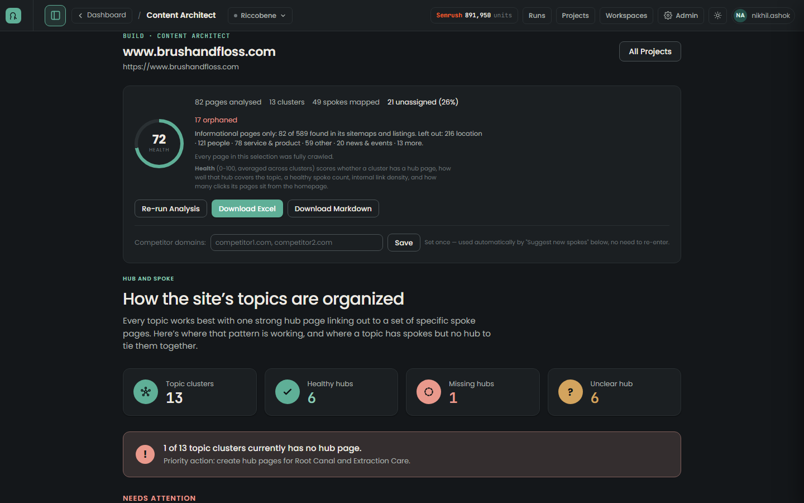

## Knowledge Base

**What it's for:** holding each client's brand voice, industry rules and feedback for the AI tools.
**First impression:** an internal admin tool, not a product screen.

| ID | Screen | What's wrong | Why it matters to you | Priority |
|---|---|---|---|---|
| KB-1 | Opening an entry | When an entry can't be loaded, the editor opens **empty** with no error message, but still offers "Delete KB" and "Save". *Correction: in our test every entry failed to load because of the local setup (the knowledge-base folder setting points at the server's path, not this computer's). The dangerous behaviour, an empty editor with Save live, is real wherever a load fails.* | Saving here could overwrite a real knowledge-base entry with nothing. | High |
| KB-2 | List | Entries are named by internal IDs ("dental-service-organizations", "gentle-dental"). The "Modules" column lists internal tool codes. A test entry ("test1") is visible. | Hard to read, and it looks unfinished. | Medium |
| KB-3 | Whole section | Its own client list ("All clients") and its own second breadcrumb bar. | Another island. | Medium |
| KB-4 | Editors (dark theme) | The text editor is a **bright white box** inside the dark page. | A visible theme bug on every KB editing screen. | Medium |
| KB-5 | New KB wizard | A six-step wizard with lowercase technical option names ("client-feedback", "Brand Slug"), and a sixth style of step bar. | Unclear for anyone but the builder. | Low |
| KB-6 | Dependency Audit | An engineer's page (tool codes, file paths, "Not found in index"). One card has no title at all. | Useful to engineers, and it shouldn't sit in the product's main flow. | Low |

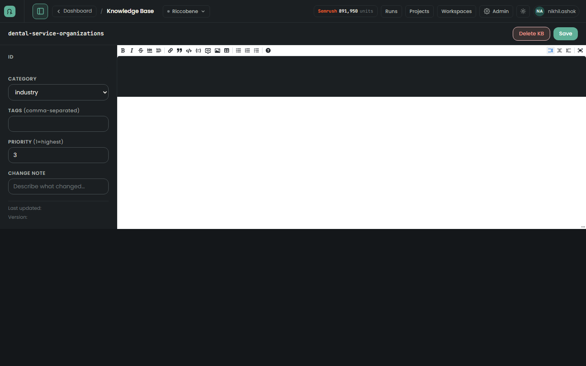
*An existing entry opens empty, with Delete and Save available.*

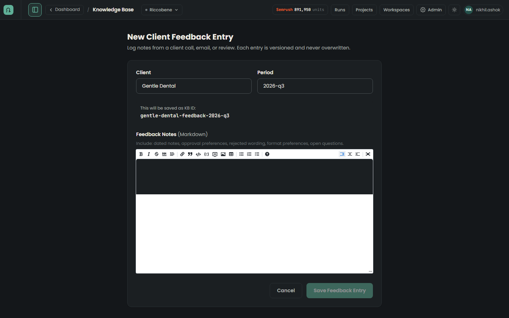

---

## Site Crawler and the crawl report (Tech Audit)

**What it's for:** crawling a whole site, scoring it, and listing every technical problem.
**First impression:** the report's issue pages are among the best screens in the app. The start screen and the headline numbers undermine them.

| ID | Screen | What's wrong | Why it matters to you | Priority |
|---|---|---|---|---|
| CRW-1 | Crawler start screen | The page title says **"CrawlScope"**; the menu and header say "Site Crawler", and Home calls the same thing "Tech Audit". | Three names for one tool. | Medium |
| CRW-2 | Numbers across screens | The same crawl gives different figures on different screens: • pages crawled: 1,137 on Home, 1,356 on the report • errors: 5, 62 and 65, without saying what each counts • page cap: "up to 500 pages" on the crawler, "budget 10,000" on the report • the issues summary reads "7,895 findings on **2,140 of 1,136 pages**" | People quote the wrong number to clients. "2,140 of 1,136" is visibly impossible. | High |
| CRW-3 | Report while loading | A crawl that finished yesterday first shows "not scored", "Provisional — the full audit runs when the crawl finishes" and "Not measured until the crawl finishes" while its data loads. | It looks as if the crawl never finished. | High |
| CRW-4 | Triage | The review buttons on each issue (Needs review / Confirmed / False positive / Resolved) fail every time: the save step doesn't exist. **(seen in the code)** | Users can't mark false positives. They get an error and redo the same triage after every crawl. | High |
| CRW-5 | Report overview | A long paragraph listing every check that couldn't run sits on the first screen, next to "Since the crawl of 22 Sep: 1,327 new issues, 11,094 fixed, 7,051 still open". Those numbers don't match the 39 problems listed. | The overview explains edge cases before it explains the site. | Medium |
| CRW-6 | Recent runs | Runs are listed by raw ID ("project 8f6473f6-…", "run 372bfc54-…"). | Unreadable. | Medium |
| CRW-7 | Stop crawl | Stops immediately, with no confirmation. **(seen in the code)** | One mis-click ends a long crawl. | Medium |
| CRW-8 | Two progress bars | The bar across the top of every screen and the bar on the report measure progress differently. The report's bar can move backwards as new links are found. **(seen in the code)** | Two answers to "how far along is it?". | Medium |
| CRW-9 | Issue pages | Good: plain-English "What the check looks for" and "The fix", page counts and priority. This is the model to copy elsewhere. | — | — |

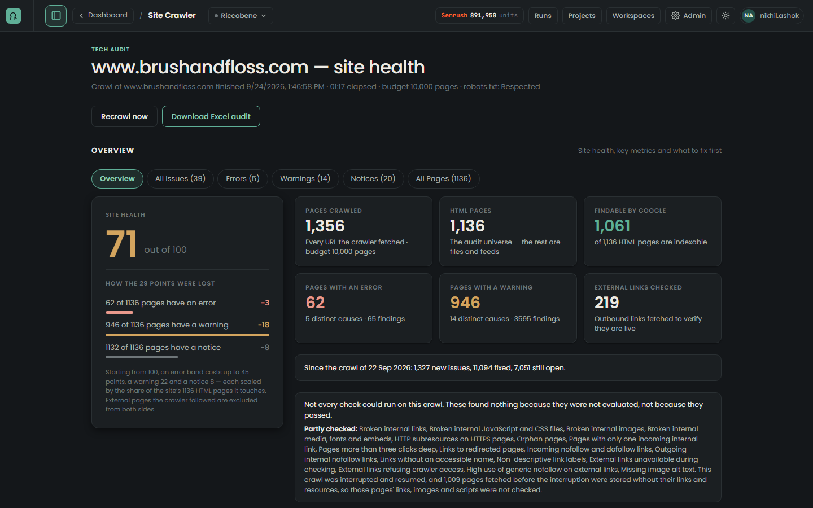
*1,356 pages crawled here, 1,137 on Home. The explanation paragraph takes up the first screen.*

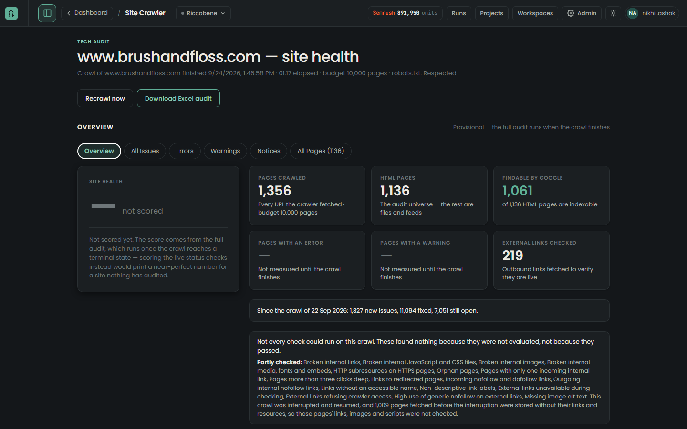
*The same finished crawl while it loads: "not scored" and "Provisional".*

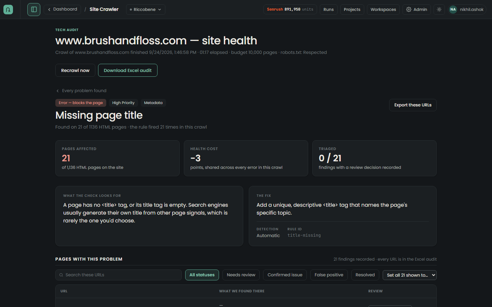
*An issue page: the clearest writing in the app.*

---

## Screens not in the menu

| ID | Screen | What's wrong | Why it matters to you | Priority |
|---|---|---|---|---|
| HID-1 | Robots Monitor | Reachable only by typing the address. It has no title (the header says "SEO Studio"), its own client list, and a settings page warning that "credentials… are stored in plaintext on disk". That warning is also out of date: the data now lives in the database. | An important monitoring tool that nobody can find, with a warning that alarms and misleads. | Medium |
| HID-2 | Content Enhancement | Reachable only by address. The header says "SEO Studio", and it defaults to "Paste HTML". | Invisible tool. Pasting page code is a developer's task. | Low |
| HID-3 | Agent Readiness share page | Shows "Invalid or missing summary data" when opened without data. | See AGR-4. | Low |

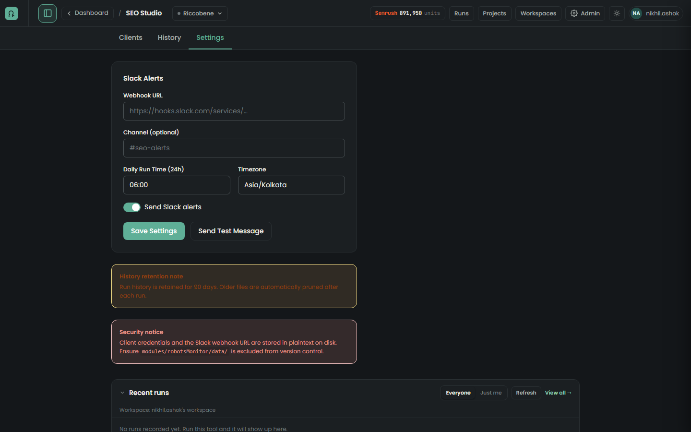

---

## Top 10 fixes overall

| # | Fix | Clears | Size |
|---|---|---|---|
| 1 | **Make the header's client drive every tool.** Remove the separate client lists in Content Research, Competitor Analysis, Content Writer, Location Pages, the Knowledge Base and Robots Monitor, and use one competitor list per client. | APP-1, CRS-1, CMP-1, CW-1, LOC-1, KB-3, HID-1, CAR-2 | Big |
| 2 | **Make the numbers agree.** Use one definition each for pages crawled, errors, page cap and competitors, and show it the same way on Home, the crawl report and Competitor Analysis. Fix "2,140 of 1,136 pages". | CRW-2, HOME-2, HOME-3, CMP-2, CRW-5 | Medium |
| 3 | **Make badges follow the score.** "Healthy" never appears on a red score, and "Passed" never appears next to failing numbers. | HOME-1, CMP-2, SG-4 | Quick |
| 4 | **Remove every visible programming error and engineer message:** "[object Object]", "1 of undefined", "Failed to fetch", "Seed … data", raw IDs, raw data dumps, server-setup warnings. | APP-11, AIVS-1, SG-1, AGR-1, LOC-3, CAR-1, ACC-2, CRW-6, AIV-1 | Quick–medium |
| 5 | **Opening a screen never starts work.** SEO & GEO, Content Architect and Competitor Analysis should only run jobs when someone presses Run. | APP-5, SG-2, CAR-1, CMP-4 | Quick |
| 6 | **Fix the three broken actions:** crawl triage (it never saves), Knowledge Base "Edit" (it opens empty but offers Save and Delete), and the AI Visibility measurement that is forgotten when you leave the page. | CRW-4, KB-1, AIV-5 | Quick–medium |
| 7 | **One set of building blocks.** Pick one of the three kits, move every screen onto it, and give every tool the same page frame: title, one-line purpose, primary action in the same place, same width. | APP-2, APP-6, KW-1, ARC-1, IMG-1, ENH-2, LOC-2, ACC-6 | Big |
| 8 | **Honest loading states.** Show a branded loading screen instead of a blank one, one skeleton style everywhere, and never "No client selected", "Add a client" or "not scored" while data is still loading. | APP-8, CMP-3, CRW-3, HOME-9 | Medium |
| 9 | **Put the answer first.** On Home, move the executive summary to the top. On AI Visibility, show the result before the notices. On SEO & GEO, write the priority verdict in plain English. Stop cutting off card titles. | HOME-5, HOME-4, AIV-1, SG-3, HOME-6 | Quick–medium |
| 10 | **Show the menu, and retire the badges.** Open the tool list by default for new users. Replace "Internal / Beta / Testing" with a single "New" tag, or hide unfinished tools from people outside the team. | APP-3, APP-4 | Quick |

---

## What has been fixed (25 Sep 2026)

The "safe batch" (fixes 2, 3, 4, 5, 6, 8, 9 and 10, plus the one-line bugs) is done in the code on this branch. It has not been deployed. Fixes 1 and 7 are larger jobs with their own plans: [one client, everywhere](02-plan-one-client.md) and [one set of building blocks](03-plan-one-kit.md).

| Fixed | What changed |
|---|---|
| CRW-4 | Triage decisions save. |
| CRW-2 | The issues summary counts each page once, so it can never name more pages than exist. The report's first tile is now "URLs fetched" (pages, images and files), so it no longer shares a name with Home's HTML page count. Error and warning tiles say "types of problem" and "instances". "Budget" is now "page limit" everywhere. |
| CRW-3 | A finished crawl shows "Loading the audit results…" while its findings load, not "Provisional / not scored". |
| CRW-1 | The crawler page is titled "Site Crawler". |
| HOME-1, SG-4 | Home badges follow the score: 80+ "Good", 60–79 "Needs attention", under 60 "At risk". Run status no longer says "Healthy". |
| HOME-4 | Module card titles wrap to two lines instead of being cut off. |
| HOME-9 | The header says "Loading clients…" instead of "Add a client" while the client list loads. |
| CMP-2 | The page-speed badge says what it measures ("Real users: Core Web Vitals passed / need work / failed"), or "No real-user data from Google yet". |
| CMP-3 | Competitor Analysis says "Loading competitor analysis…" instead of "No client selected" while it loads. |
| APP-5, SG-2, CMP-4, CAR-1 | Opening SEO & GEO, Competitor Analysis or Content Architect no longer starts work. SEO & GEO's On-Page check starts only after a fresh run on that screen. Content Architect offers a "Start analysis" button, re-checks only while something is running, and replaces "Failed to fetch" with a plain message. |
| KB-1 | An entry that can't be loaded shows "This knowledge base could not be opened. Nothing has been changed." with a way back. There's no editable empty document. |
| KB-4 | The Markdown editors follow the dark or light theme. |
| AIV-5 | The scraped AI Visibility "Measure" button picks up a run already in progress, and says so if one overruns. |
| AIVS-1 | The date range shows instead of "[object Object]". |
| SG-1, AGR-1 | "1 page audited" (or "1 of N crawled pages") instead of "1 of undefined crawled". |
| APP-11, ACC-2, CRW-6 | Run lists and Run history show "Riccobene (whole site)", "An earlier crawl" and so on instead of raw ids. The run drawer tucks the raw data under "Technical details". The location wizards say "hasn't been set up yet" with a "Set up …" button, not "Client not found / Seed … data". Robots Monitor's out-of-date "plaintext on disk" warning is gone. |
| AIV-1, AIV-2 | AI Visibility shows the report first and its caveats after. A missing assistant reads "Claude is not connected, so these results do not include its answers." Warnings show in warning colours. |
| APP-6 | The header names Projects, Workspaces, Run history, Administration, Robots Monitor and Content Enhancement. |
| APP-8 | A branded "SEO Studio · Loading…" screen replaces the blank first load. Slow route changes show a quiet "Loading…" after 0.4 seconds. |
| APP-3 | Menu and card badges are one quiet "Beta" pill. The exact status (Internal Only, Internal Testing) is in its tooltip. |
| APP-4 | The tool menu starts open, on Home and on every tool page, and each person's choice to close it is remembered. The collapsed menu's button reads "Tools". |
| APP-16 | The hidden menu is taken out of the Tab order. |
| ACC-4 | Admin shows "116% of the limit, 16% over" instead of "100% used". |

APP-4 reverses an earlier product decision recorded in the code (menu collapsed by default), changed after the product owner confirmed it. Each person's menu preference resets once to the new default, then is remembered as before.

**Kept as designed:** HOME-5. The executive summary stays below "Where we stand", on the product owner's decision: the module scores come first, then the summary of them.

**Not in this batch:** confirmation steps for destructive actions (APP-15), SEO & GEO's AI-written verdict wording (SG-3; this is a prompt change, not a screen change), and the motion items in Appendix B.

---

## Appendix A — Screenshot index

All screenshots are in [`screenshots/`](screenshots/). They were taken at 1440 × 900 in the dark theme unless the name says otherwise.

| File | Screen |
|---|---|
| 00-login.png | Sign-in card |
| 01-home.png, 01-home-full.png | Home (Riccobene), top of page and full length |
| 01-home-acalvio.png | Home for a second client (Acalvio) |
| 01-home-sidebar-open.png | Home with the tool menu open |
| 01-home-client-switcher.png | Header client switcher |
| 01-home-light.png | Home in the light theme |
| 01-home-mobile.png | Home at phone width |
| 01-home-loading-0.8s.png, 01-home-loading-5s.png | Home loading on a slower connection |
| 02-projects.png, 03-workspaces.png, 04-runs.png, 04-runs-drawer.png, 05-admin.png | Account screens |
| 10-keyword-research.png | Keyword Research |
| 11-content-research.png | Content Research |
| 12-article-recommendation.png | Article Recommendation |
| 13-market-potential.png | Market Potential |
| 14-competitor-analysis.png, 14-competitor-analysis-pagespeed.png, 14-competitor-analysis-loading.png | Competitor Analysis |
| 20-article-enhancement.png | Enhance Existing Article |
| 21-ai-visibility.png, 21-ai-visibility-answers.png | AI Visibility |
| 22-ai-visibility-scraped.png | AI Visibility (scraped), hidden from the menu |
| 23-seo-geo-audit.png, 23-seo-geo-audit-tech.png | SEO & GEO Audit |
| 24-agent-readiness.png | Agent Readiness Audit |
| 25-image-alt-audit.png | Image Alt Tag Audit |
| 30-content-writer.png | Content Writer |
| 31-location-pages.png, 32-location-wizard.png, 33-location-neuro.png, 34-location-cbh.png | Location + Service Pages |
| 36-content-architect.png, 37-content-architect-report.png | Content Architect |
| 38-knowledge-base.png, 39-kb-new.png, 40-kb-audit.png, 41-kb-feedback.png, 42-kb-editor.png | Knowledge Base |
| 50-site-crawler.png | Site Crawler start screen |
| 51-crawl-report.png, 51-crawl-report-issues.png, 51-crawl-report-issue-detail.png | Crawl report |
| 51-crawl-report-while-loading.png, 51-crawl-report-loading.png | Crawl report loading states |
| 51-crawl-report-mobile.png | Crawl report at phone width |
| 60-robots-monitor.png, 60-robots-monitor-settings.png | Robots Monitor (not in the menu) |
| 61-content-enhancement.png | Content Enhancement (not in the menu) |
| 64-agent-readiness-share.png | Agent Readiness share page without data |

---

## Appendix B — Notes for the developers

Paths are relative to `client/src/`. Line numbers are from this branch.

### B1. Confirmed defects behind the findings

| Finding | Where | Detail |
|---|---|---|
| CRW-4 triage never saves | `pages/CrawlScopeRunPage.jsx:615`, `:636` | Calls `cs.saveReviews`, which `lib/crawlScopeApi.js` does not export. The server route `PATCH /runs/:id/findings` exists. |
| KB-1 editor opens empty | `pages/KBEditorPage.jsx` → `GET /api/kb/:id` (`server/routes/kb.js:16-19`) | The editor never checked `res.ok`, so a 404 rendered as an empty document with Save and Delete live. In the audit the 404s were local: `.env` sets `KB_ROOT=/app/knowledge-base` (the container path), which on Windows resolves to `D:\app\knowledge-base`, an index copy with only `test1.md`. |
| AIVS-1 `[object Object]` | `pages/AiVisibilityPage.jsx:215-222` | The basis line joins `m.period` into a string; `period` is an object, not text. |
| SG-1 / AGR-1 `1 of undefined crawled` | Project report bar shared by the SEO & GEO and Agent Readiness pages | The crawl total is undefined when rendered. |
| CRW-2 `2140 of 1136 pages` | `pages/CrawlScopeRunPage.jsx:729-732` | Adds `affectedErrorPages + affectedWarningPages + affectedNoticePages`, so a page with issues in several bands is counted more than once. The denominator is `htmlCount`. |
| CRW-3 provisional while loading | `pages/CrawlScopeRunPage.jsx:417` | `provisional = running \|\| findingsState !== 'ready'`. A finished run shows the provisional note (`:734-735`) and "not scored" until findings arrive. |
| HOME-7 dashboard blanks on Re-run | `pages/HomePage.jsx:262-266` → `:194` | `runModule` calls `loadOverview(projectId)` without `{ quiet: true }`. |
| AIV-2 warnings in accent colour | `pages/AiVisibilityLitePage.jsx:403`, `:610` | Pass `tone="warn"`; `Kicker` (`components/studio/primitives.jsx:41`) only understands `muted`. |
| APP-14 toasts | `ui/Toast.jsx:33-38`, `:57-107` | No `role` or `aria-live`; errors expire after 5s like successes; the close button has no label and uses `outline: none`. `CrawlScopePage.jsx:79,213` pass `variant: 'error'` (valid values: success, danger, warning, info), so the icon falls back to info. `components/aiVisibility/BrandsPanel.jsx:52,56,69` call `toast.show`, which doesn't exist. |
| APP-13 no error screen | `components/ChunkErrorBoundary.jsx:94` | Rethrows every non-chunk error, and it is the only boundary in the app. |
| APP-8 blank first load | `App.jsx:82-84`, `components/MacWindow.jsx:19-20` | The auth check and the lazy-route fallback both render an empty box. |
| APP-5 work started on open | `pages/SeoGeoAuditPage.jsx:281-291` with `hooks/useOnPageTab.js:101-105`; `pages/ContentArchitectPage.jsx:113-136`; `pages/CompetitorAnalysisDashboardPage.jsx:373-388` | These POSTs were observed and blocked in the audit: `POST /api/on-page-audit/run` and `POST /api/projects/:id/content-architect`. |
| APP-6 generic header title | `components/MacWindow.jsx:719` | `currentTool ? currentTool.label : 'SEO Studio'`. |
| APP-16 hidden links focusable | `components/MacWindow.jsx:778` | The collapsed sidebar is `width: 0; overflow: hidden` but not `inert`; Tab reaches its search box and links. |

### B2. Shared components (pick-ui-library check)

**What's installed.** `client/package.json` has no UI-primitive, toast, chart, animation or virtualization library. It has react-router, TipTap, `@uiw/react-md-editor`, react-simple-maps, xlsx and docx.

**Four rival kits:**
- `ui/` (16 parts)
- `components/studio/primitives.jsx`
- `components/seoGeo/primitives.jsx`
- `components/seoGeo/report/reportKit.jsx`

**Census** (a scripted count of imports and markup across 68 page files and component folders):
- `ui` is imported 94 times, `studio` 9, `seoGeo` 1, `reportKit` 5.
- 366 raw `<button>`s against 153 kit buttons.
- 54 raw `<table>`s.
- About 4,984 inline `style={{…}}` objects.
- 271 hex and 130 rgba literals.
- 37 `@keyframes`.
- 11 `alert`/`confirm` calls.

**Which kit each module uses:**
- **`studio`:** Home, Projects, Admin, AI Visibility.
- **`ui`:** Crawler, Runs, Workspaces, Competitor Analysis, Content Architect, Market Potential, AI Visibility (scraped), Content Writer.
- **`seoGeo` / `reportKit`:** SEO & GEO.
- **No kit:** Keyword Research (and its public copy), Content Research, Article Recommendation, both Article Enhancers, Content Enhancement, Image Alt, Agent Readiness, Knowledge Base (list, editor, create, feedback, audit), Location Pages (list, Neuro, detail), Robots Monitor, Login, Profile setup.

| Task | Today | Curated pick | Note |
|---|---|---|---|
| Toasts | Hand-built `ui/Toast`, plus a second one in `RobotsMonitorPage.jsx:194-223` | **Sonner** | Brings `aria-live`, stacking, exit motion, and a longer or persistent duration for errors. |
| Dialogs, menus, popovers | `ui/Modal` (Escape only; no `role="dialog"`, focus trap or initial focus); custom sheets (Home "Run Full Audit", Location "New Page"); div-built client switcher and account menu | **base-ui** | Accessibility and dismissal handled once, for all of them. |
| Charts | Hand-drawn radar, bars, rings and strips per module | **recharts** | For consistency; the hand-built ones each have their own colours and scales. |
| Animated numbers | Agent Readiness count-up re-renders text (`AgentReadinessAuditPage.jsx:166-171`) | **NumberFlow**, or no animation | See B3. |
| Long lists | Crawl tables paginate at 25 rows (`IssueDetail.jsx:22`, `UrlsTable.jsx:27`) | — | Not a problem; no virtualization needed. |
| Conditional styling | ~5,000 inline style objects rather than classNames | cva, once styles move into kit variants | The real issue is that styles aren't shared, not the syntax. |
| Rich text | TipTap (Content Writer) and `@uiw/react-md-editor` (Knowledge Base) | Off-list: keep one (TipTap) | The md-editor is what renders the white box in dark mode (KB-4). |
| Theme switching | Custom `ThemeContext` with a dark pre-paint | — | Fine as it is; the curated next-themes is Next.js-specific. |

### B3. Motion review (review-animations)

The motion tokens exist (`index.css:128-129`: `--ease: cubic-bezier(0.2, 0.6, 0.2, 1)`, 120/160/240 ms), but about two thirds of transitions hard-code their own values.

| Before | After | Why |
|---|---|---|
| `transition: 'all 0.15s'`: `KeywordResearchPage.jsx:357,703,722,759`; `KeywordResearchPublicPage.jsx:341,598,635`; `ArticleEnhancementPage.jsx:864-865`; `ArticleEnhancementLitePage.jsx:669-670`; `components/ExportButtons.jsx:100`; `components/seoGeo/AuditInputPanel.jsx:25` | `transition: background-color, border-color, color var(--dur-fast) var(--ease)` | `all` animates unintended properties off the GPU. |
| `components/ProgressSteps.jsx:58`: `all var(--dur-std) var(--ease)` | `background-color, color var(--dur) var(--ease)` | `--dur-std` is undefined, so it never runs; `all` again. |
| Sidebar `width 160ms ease` (`MacWindow.jsx:778`), plus `width/padding` (`:578`), `width/height` (`:657`) and `margin-left` (`:1030`) | No animation; or an overlay panel moved with `transform: translateX(-100%) → 0`, 200ms `cubic-bezier(0.32, 0.72, 0, 1)` | Tens of toggles a day, and every frame reflows the whole dashboard. |
| Tab underline `left, width var(--dur)` (`ui/Tabs.jsx:111`) | Snap, or `transform: translateX() scaleX()` | 100+ uses a day means no animation, and never layout properties. |
| Bar fills animate `width`: `CrawlStatusBar.jsx:152` (600ms), `CrawlScopeRunPage.jsx:879` (300ms), `AdminPage.jsx:392`, `KpiScorecard.jsx:64`, `RankedBarChart.jsx:71`, `seoGeo/primitives.jsx:209` (500ms) | Data bars: none. Progress bars: `transform: scaleX()`, `transform-origin: left`, 240ms linear | These are figures people read; decoration hinders, and `width` is a layout property. |
| `ui/ScoreRing.jsx:74` fill replays over 600ms on every mount while the number jumps (`:91`) | Render final state; if kept, once per session at ≤240ms | Replays on every tab switch; over budget. |
| Agent Readiness 800ms count-up on every tab return (`AgentReadinessAuditPage.jsx:166-171`) | Show the number; if kept, animate once via NumberFlow | Frequent, and over budget. |
| `ui/Modal.jsx:38,56`: 240ms enter, instant exit | Keep enter; add exit `opacity 1 → 0, scale 1 → 0.97`, 150ms `cubic-bezier(0.23, 1, 0.32, 1)`; stay centred | Asymmetric exit; nothing should vanish with no bridge. |
| `ui/Toast.jsx:81,84`: keyframe `toastIn` injected per toast, no exit | Transitions with `@starting-style` (`translateY(100%)`, `opacity 0`), exit the same edge, 200ms | Keyframes restart and can't be interrupted; the stack snaps. |
| `--ease: cubic-bezier(0.2, 0.6, 0.2, 1)` | `--ease-out: cubic-bezier(0.23, 1, 0.32, 1)` | The current curve is weak for entrances. |
| About 20 separate `@keyframes spin` in 4 shapes and 3 speeds | One shared spinner in the kit | Cohesion. |
| `prefers-reduced-motion` only at `index.css:266` and `AgentReadinessAuditPage.jsx:167` | A global reduced-motion block: stop pulses and loops, keep opacity and colour | Accessibility. |

**Verdict: Block.** There are layout-property animations with easy GPU fixes, `transition: all` in 14 places, animation on high-frequency tab and sidebar actions, and reduced motion is mostly ignored. There are no feel-breaking entrance curves; the app mostly does too little, not too much.

### B4. Missing feedback and motion opportunities (find-animation-opportunities)

| # | Location | Today | Purpose | Frequency | Suggested motion |
|---|---|---|---|---|---|
| 1 | Home "Run Full Audit" (`HomePage.jsx:331`) | Sheet closes, nothing happens until the crawl bar appears | Feedback | Occasional | The button enters a pending state immediately ("Starting…", spinner, disabled) until the crawl is confirmed. No motion beyond the existing spinner. |
| 2 | Live crawl bar (`MacWindow.jsx:862-872`) | Pushes the page down about 90px when it appears | Preventing a jarring change | Occasional | Reserve its space, or overlay it; enter `translateY(-100%) → 0`, 200ms `cubic-bezier(0.23, 1, 0.32, 1)`; exit the same way. |
| 3 | Toast stack (`ui/Toast.jsx`) | Disappears instantly, and the others jump | Spatial consistency | Occasional | Exit `translateY(8px)` + `opacity 0`, 150ms `ease-out`; move to Sonner (B2). |
| 4 | Modal and drawers (`ui/Modal.jsx:24`, `RunDetailDrawer.jsx:70`, `MarketDrawer.jsx:69`) | Modal vanishes; drawers slide out empty or don't slide | Preventing a jarring change | Occasional | Keep content mounted until `transitionend`; modal exit as in B3; drawer keeps its 240ms transform. |
| 5 | Pressable kit buttons (`ui/Button.jsx`, studio `Btn`) | No press state | Feedback | Tens per day | `:active { transform: scale(0.97) }`, `transition: transform 120ms ease-out`, hover styling gated by `@media (hover: hover) and (pointer: fine)`; gentler under reduced motion. |

**Rejected candidates:**
- **Tab switches across the report tabs:** rejected at the Frequency gate (100+ a day, often keyboard).
- **Sidebar open and close:** rejected at the Frequency and Function gates. It should be instant, or moved off layout properties (B3).
- **Growing bars and count-ups on score screens:** rejected at the Function gate. People are reading these figures.
- **Staggered entrance of the Home cards:** rejected at the Frequency gate, as a daily dashboard.

**Verdict:** the interface needs very little motion. The highest-leverage change is not motion at all but #1, immediate feedback when a long job starts, followed by #2 so the crawl bar stops shoving the page. To turn any row into an implementation plan, run `improve-animations plan <row>`.

---

Next: fix list → [Top 10 fixes overall](#top-10-fixes-overall)
