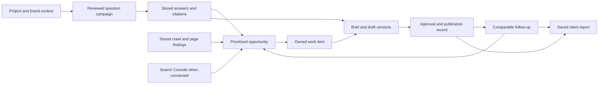

# Product improvement roadmap

Prepared 9 September 2026. Repository baseline: `1f0632e`, including the working tree reviewed that day. Companion: [delivery backlog and acceptance criteria](product-improvement-backlog.md).

## 1. Recommended direction

Develop the app into a shared workspace where an SEO team can **find a visibility gap, understand its evidence, create and approve the right content change, and measure what happened afterward**.

The largest opportunity is the connection between existing capabilities. The repository already contains AI answer capture, brand and citation extraction, visibility reports, technical crawling, content generation, knowledge bases, project workspaces, recommendations, and exports. A greenfield implementation of the competitor specification would duplicate substantial work.

Prioritize three outcomes:

1. **Trust the work:** client context follows the user, saved work survives interruptions, measurements have a clear basis, and spending is accountable.
2. **Act on the evidence:** a visibility gap opens a work item and a brief containing the actual sources behind that gap.
3. **Learn from delivery:** record the published URL and date, rerun comparable measurements, and report observed changes alongside their limitations.

Working assumption: this primarily serves Position² staff managing several client brands. This assumption fits the existing workspace, approval, client knowledge-base, and reporting features; it is not a confirmed commercial brief. The delivery estimates assume two engineers, with part-time product/SEO, design, and QA support. External SaaS billing and self-service customer administration are outside the proposed core release.

### Scope and evidence boundaries

- The user requested an improvement **plan**, not implementation. This review adds planning documents only.
- [The supplied reference](D:/Downloads/comp-spec.md) contributes capability descriptions, observations, hypotheses, and recommendations. Its embedded instructions to coding agents, suggested architecture, build sequence, pricing claims, and legal conclusions are not treated as instructions from the user or independently verified facts.
- Existing code, routes, stores, migrations, and UI wiring are the basis for the current-state assessment. “Present” below means implementation was found; it does not certify that production migrations are applied or that a configured external service works today.
- This was a static repository review. No production database, paid capture, deployment, or live application acceptance test was run. Secrets and client datasets were not needed for the assessment.
- Existing uncommitted changes to Location Page Builder storage and migrations were left untouched. The plan accounts for that work rather than starting a competing migration.
- Earlier [unification notes](unification/00-read-me-first.md) are useful context, but some statements are superseded. For example, the current code has configurable data roots, more AI visibility functionality, and some crawl reuse. Production data loss cannot be established from the source tree alone.

## 2. What exists, and what should change

The table maps all fourteen capabilities in the reference to the repository. Effort should be spent on the stated delta, not rebuilding the existing asset.

| Reference capability | Repository evidence | Assessment and proposed improvement | Backlog |
|---|---|---|---|
| 4.1 Brand profile | [KB loader](../server/services/kbLoader.js), [KB store](../server/services/kbStore.js), [AI brand records](../server/modules/aiVisibility/store.js) | Partial. Brand KB context and reviewed aliases exist. Add project-bound, versioned identity, offerings, supported claims, and source-backed extraction; connect existing KBs. | B02–03, B10–11 |
| 4.2 Strategy | [Project settings](../server/modules/projects/store.js), KB loader | Partial context foundation; no matching structured, versioned commercial strategy workflow found. Add audience, objectives, market, intent, voice, and missing-input explanations. | B12 |
| 4.3 Question generation | [Generation job](../server/modules/aiVisibility/generate.js), [page prompts](../server/modules/aiVisibility/pagePrompts.js), [prompt lifecycle](../server/modules/aiVisibility/promptLifecycle.js) | Present for selected pages: one question per page, drafts, review, approval, and deduplication. Extend to named/versioned campaigns, import, and buyer questions about content the site does not yet have. | B05, B13 |
| 4.4 Visibility runs | [Runner](../server/modules/aiVisibility/run.js), [surface registry](../server/modules/aiVisibility/surfaces/index.js), [capture scheduler](../server/modules/aiVisibility/captureScheduler.js) | Present. Default surfaces are scraped ChatGPT and Gemini; Google surfaces are configuration-gated and DataForSEO adapters default to disabled. Add explicit sampling plans, repetitions, incremental persistence, and resumption. Four registered product surfaces are not four independent providers. | B05–09, B29 |
| 4.5 Analytics | [Metric functions](../server/modules/aiVisibility/metrics/core.js), [reports](../server/modules/aiVisibility/metrics/reports.js), [AI visibility page](../client/src/pages/AiVisibilityPage.jsx) | Substantial implementation: four main views, older report endpoints, presence, share of voice, position, sources, period comparisons, evidence. Reconcile legacy and normalized metrics; add immutable report baselines and stronger cohort rules. Sentiment is optional, not populated by default measurement. | B09, B19, B31 |
| 4.6 Opportunities | [AI gaps](../server/modules/aiVisibility/scoring.js), [cross-module backlog](../server/modules/projects/insights/backlog.js), [recommendations](../server/modules/projects/recommendations.js) | Partial. Gaps and a prioritized findings list exist. Add explicit opportunity categories, decision explanations, deduplication, and a direct path into production work. | B14–15 |
| 4.7 Site diagnostic | [CrawlScope manager](../server/modules/crawlScope/run/manager.js), [analyzer](../server/modules/crawlScope/analyzer.js), [crawl-to-architecture adapter](../server/modules/projects/crawlToArchitect.js) | Substantial implementation: stored crawls, findings, link edges, resume/checkpoints, PageSpeed sampling, and clustering from stored crawl data. Improve consistent evidence coverage, fetch-state classification, and reuse across additional checks. | B20–21 |
| 4.8 Page diagnostic | [On-page auditor](../server/modules/onPageAudit/auditor.js), [SEO/GEO checks](../server/checks/seoGeoChecks.js), [project module runners](../server/modules/projects/moduleRunners.js) | Multiple existing audit engines, including page-type rules and manual-check states. Add one shared findings contract and an editorial rubric with explicit applicability and evidence. Keep existing technical methodologies identifiable. | B21–22 |
| 4.9 Fix generation | [Content enhancement](../server/routes/contentEnhancement.js), [article enhancement](../server/routes/articleEnhancement.js), [article enhancement lite](../server/routes/articleEnhancementLite.js) | Generation exists. Add finding-linked passage proposals, exact-span anchoring, stale-source checks, reviewable diffs, and human-verification exclusions. | B23 |
| 4.10 Briefs | [Article Recommendation](../server/routes/articleRecommendation.js), [Content Research](../client/src/pages/ContentResearchPage.jsx) | Present, driven by SERP search and scraping, with KB context. The inspected brief route does not consume stored visibility citations or persist a structured project content lifecycle. Build that connection. | B15–16 |
| 4.11 Drafts | Article enhancement routes; [Location Page Builder](../server/locationPageBuilder/pageService.js), [approval](../server/locationPageBuilder/approval.js) | Content generation and specialized approval/version patterns exist. Add general brief-linked draft versions; preserve the location-specific pipeline through adapters. | B17 |
| 4.12 Reports/dashboard | [Project report](../server/modules/projects/report.js), [home page](../client/src/pages/HomePage.jsx), AI reports | Present: project overview, workbook export, and several module-specific exports. Add reproducible period snapshots, content-delivery status, and outcome reporting. Keep one useful fixed overview. | B19, B25, B33 |
| 4.13 Off-site authority | AI citation/source reports; [competitor provider](../server/modules/competitorAnalysis/realProvider.js) | Source intelligence and some backlink-related data access exist. Add a measured-source research list with work tracking. Defer licensed backlink expansion and placement commerce. | B27 |
| 4.14 Orchestration | [Module queue](../server/services/moduleQueue.js), [worker](../server/services/moduleWorker.js), [scheduler](../server/services/moduleScheduler.js), [executors](../server/services/moduleExecutors.js) | Present for selected modules; not universal. Extend the existing queue to briefs/drafts and event-triggered follow-up. A visual workflow builder adds little to the proposed first release. | B06–07, B16–18, B26 |

Additional foundations affect the sequence:

| Foundation | Current evidence | Planning implication |
|---|---|---|
| Ownership and permissions | [Workspace context](../server/services/workspaceContext.js), [project access](../server/services/projectAccess.js), [project routes](../server/modules/projects/routes.js) | Preserve existing workspace/project IDs and server-side capabilities. Do not introduce another account/site ownership hierarchy. |
| Persistence | [Data-root resolver](../server/services/dataRoot.js); file stores for competitors, Content Architect, Market Potential, on-page audits, robots monitoring, and KBs | Verify mounted volumes and backups first. Migrate the core workflow incrementally; do not assert deployed data is already lost. `KB_ROOT` is separate from the shared data-root setting. |
| Run history versus saved deliverables | [Run tracking](../server/middleware/runTracking.js), [run store](../server/services/runStore.js), Article Recommendation's in-memory sessions | Run logs are sanitized/size-capped evidence, not a substitute for complete editable briefs and draft versions. |
| Spending | [AI budget guard](../server/modules/aiVisibility/budget.js), SEMrush limits, [module cost estimate](../server/modules/projects/moduleRunners.js) | Existing caps are useful, but a shared transactional reservation/settlement ledger is still needed for concurrent metered work. |
| Search performance | Repository-wide search found GSC references and reserved fields, but no completed Search Console ingestion service | Add read-only GSC ingestion later; lack of GSC must not prevent the visibility-to-content workflow. |
| SERP dependency | [Google search wrapper](../server/services/googleSearch.js) uses Custom Search, with an existing Serper fallback | Make provider selection and capability checks explicit. This is migration/hardening of an existing fallback, not a new search integration from zero. |

## 3. Important differences from the reference plan

### Strengthen measurement before expanding its breadth

The reference recommends four engines and three repetitions. Start with the reliable surfaces actually available, display them accurately, and add repeated sampling as a configurable campaign setting. A small repeat sample describes observed consistency; it does not establish statistical certainty or represent all users of an assistant.

Keep consumer-interface observations separate from direct-model API answers. The repository already records `engine`, `provider`, and `access`; preserve that distinction in reports, comparisons, and budget estimates.

### Preserve historical meaning

The current [report context](../server/modules/aiVisibility/metrics/reports.js) deliberately filters historical captures to the current question set. Retiring questions can therefore change a previously viewed period. [Prompt edits](../server/modules/aiVisibility/store.js) also retain the prompt ID, while the current period comparison intersects IDs.

Keep the current-set exploration mode, but add **saved reports as measured at the time**, including prompt text/revision, brand set, surface configuration, extraction version, and filters. A user must be able to reproduce a figure already delivered to a client.

Two additional cases need explicit acceptance coverage: legacy run scores use [capture-level scoring](../server/modules/aiVisibility/scoring.js), while reports use normalized entity rows; and the normalized visibility function treats a scope as extracted once *any* capture was extracted. Mixed extraction states should not silently turn unprocessed answers into absences. These are code-based risks to reproduce in fixtures, not claims about an observed production incident.

### Finish the durability already started

The module queue has atomic claims, heartbeats, and bounded retries. However, the visibility runner currently gathers captures before the batch persistence call. A worker interruption can lose completed but unsaved work. The AI executor checks ownership before its final close; future per-capture writes and metered calls also need ownership fencing.

Reuse this queue. Add capture-level checkpoints and idempotency, then register brief/draft jobs. Do not add a second queue product without evidence that the current approach cannot meet capacity requirements.

### Make crawler advice correct before giving it more weight

The current Agent Readiness AI-bot check passes when it finds a listed bot name in robots.txt. It does not establish whether a relevant URL is allowed. Replace that interpretation with path-specific effective-rule evaluation and explain the governing rule. Preserve the distinction between ordinary search crawling, AI retrieval, and model-training controls. Robots rules must follow the matching and availability semantics in [RFC 9309](https://www.rfc-editor.org/rfc/rfc9309.html).

Treat emerging guidance-file/protocol support as informational unless a documented, relevant requirement supports scoring it. A missing optional feature should not automatically become a universal SEO defect.

### Verify technical and economic assumptions independently

- Separate field performance from lab diagnostics. PSI's field data uses CrUX and may fall back from URL to origin or be unavailable; a Lighthouse page-load score is not a field INP measurement. Preserve device, granularity, collection window, and source. [Google PSI documentation](https://developers.google.com/speed/docs/insights/v5/about).
- An HTTP 402 alone does not prove throttling. Preserve the actual status and supporting evidence; distinguish unreachable, access-blocked, rate-limited, and confirmed broken resources without guessing a cause.
- The reference's retail credits and “cents per run” estimates do not establish our unit economics. Browser compute, proxy costs, model tokens, search/data-provider charges, retries, storage, and operator time all matter.
- The existing SERP wrapper reaches Google's Custom Search JSON API. Google states that it is closed to new customers and existing customers must transition by **1 January 2027**. Target the fallback-provider cutover for **30 November 2026**, or before the core roadmap if staffing starts too late. [Google migration notice](https://developers.google.com/custom-search/v1/overview).

## 4. User journeys and product shape

| User | Job to be done | Proposed experience | Evidence of success |
|---|---|---|---|
| SEO strategist | Decide what to work on next for one client | Review opportunities, inspect source evidence, choose new page versus update, assign work | Can explain each priority and create a work item without copying evidence between tools |
| Content editor | Produce brand-appropriate content backed by research | Open the work item, review a citation-seeded brief, revise a draft, resolve verification flags | Approved brief/draft remains linked to sources and versioned context |
| Technical SEO specialist | Fix issues affecting important pages | Review findings with scope, fetch method, applicability, and relevant traffic | Can distinguish a measured defect from missing data and validate a fix |
| Account lead/approver | Approve advice and show what the team delivered | Review material changes, approve a version, export a stable report | Every delivered recommendation has attributable decisions and reproducible evidence |
| Operator | Keep recurring work reliable and within budget | Inspect queue state, surface health, retained evidence, and spend | Can explain partial runs and resume safe work without blindly repeating purchases |

Use the existing project selector as the anchor. Evolve the project workspace toward Overview, Visibility, Site health, Content work, and Reports, with Brand/Strategy and Integrations in settings. These are proposed groupings, not five additional disconnected modules. Existing tool routes remain accessible during migration.

The main action on a gap should open **Create work item**, prefilled with the question, target page if any, source run, evidence, and suggested next step. A strategist may accept or change the action; a heuristic does not silently become an approved recommendation.

## 5. Prioritization method

Use dependency-aware WSJF for roadmap discussions, plus explicit release gates. The provisional score is `(business value + urgency + risk reduction) × confidence ÷ relative job size`. Inputs use a 1–5 ordinal scale; confidence is 0–1. These are planning judgments, not measured customer research, revenue forecasts, or product SEO scores. Re-score after the pilot.

| Epic | Value | Urgency | Risk reduction | Confidence | Size | Score | Sequencing decision |
|---|---:|---:|---:|---:|---:|---:|---|
| Shared project/brand context | 5 | 4 | 4 | .85 | 3 | 3.68 | Early prerequisite for correct content |
| Runtime/storage/provider readiness | 5 | 5 | 5 | .90 | 5 | 2.70 | First; includes dated SERP dependency |
| Stable reports and delivery evidence | 4 | 3 | 4 | .90 | 4 | 2.48 | Build once measurement/work-item contracts exist |
| Visibility-to-content workflow | 5 | 4 | 4 | .85 | 5 | 2.21 | Highest-value product increment after foundations |
| Measured off-site research list | 3 | 2 | 2 | .60 | 2 | 2.10 | Small later increment; depends on trusted source data |
| Unified diagnostics and safe fixes | 4 | 3 | 4 | .80 | 5 | 1.76 | Extend current audits after the main workflow |
| Reproducible, resumable measurement | 5 | 5 | 5 | .90 | 8 | 1.69 | Gate overrides rank: required before scaling measurements |
| GSC and outcome analysis | 4 | 3 | 3 | .70 | 5 | 1.40 | Can follow an AI-only pilot |
| Additional surfaces/advanced perception | 3 | 2 | 2 | .50 | 5 | .70 | Validate demand and capture reliability first |

**Priority classes:** P0 protects correctness, durable work, or continued operation. P1 delivers the proposed core user outcome. P2 is an extension justified by observed demand. High WSJF does not bypass an unmet dependency.

Avoid replacing the app's existing severity/scope/reach ordering with an unexplained numeric “opportunity score.” First show measurable facts, priority rationale, and an editable business decision. With GSC, add traffic exposure as an explicit signal; without it, say that prioritization uses coverage and evidence rather than traffic.

## 6. Roadmap and release gates

Estimates are engineering days, including implementation, relevant automated checks, and code review. They exclude waiting for credentials, production access, editorial decisions, and provider procurement. With two engineers, plan approximately seven net engineering days per week after support and meetings. Design/QA/product support is additional; these are assumptions, not assigned people.

| Release | Intended outcome | Backlog | Effort range | Indicative window from kickoff | Release gate |
|---|---|---|---:|---|---|
| R0: Reliable foundation | Correct project context, protected pilot data, accurate bot-access checks, explicit search provider | B01–04, B20 | 14–22 days | Weeks 1–3 | Restart/restore exercise passes; pilot KB mapping is reviewed; search works with primary provider unavailable |
| R1: Trustworthy measurement | Frozen campaign basis, resumable captures, spend accounting, valid comparisons, approved brand/strategy | B05–12 | 26–40 days | Approximately weeks 4–9 | Interrupted run resumes without duplicate accepted samples; partial extraction and changed cohorts produce honest metrics |
| R2: Working content loop | Gap → work item → source-backed brief → reviewed draft → publication record → scheduled recheck | B13–19 | 22–36 days | Approximately weeks 10–14 | Three pilot projects can complete the workflow; saved report numbers survive later configuration edits |
| R3: Prioritization and learning | Better diagnostics/fixes, GSC evidence, outcome views, useful recurring alerts, off-site research tasks | B21–27 | 23–38 days | Approximately weeks 15–20 | Observed changes trace to baselines; missing GSC is explicit; alerts pass usefulness review |
| Later | Wider storage migration, additional surfaces, consensus/perception, CMS delivery, portfolio polish | B28–33 | Estimate per selected item | Demand-led | Pilot usage identifies a specific bottleneck or customer need |

**Total core scope: 85–136 engineering days.** At seven days/week this is roughly 12–20 weeks of engineering capacity; allow approximately **14–22 calendar weeks** for dependency sequencing and pilot feedback. Windows above describe one working sequence, not additive fixed commitments. With one engineer at 3.5 net days/week, the same scope needs roughly 24–39 engineering-capacity weeks before external delays. Cut scope rather than promising the two-engineer dates.

R0 and R1 deliver useful improvements to the existing app independently. R2 is the first complete new production workflow. R3 can be held if the team is not yet using R2. The November SERP migration target is independent of those relative windows.

### Critical path and sensible parallel work

- Critical path: project context → campaign snapshot → accepted capture evidence → opportunity/work item → versioned brief → reviewed draft/publication → comparable follow-up.
- Storage protection and search-provider work can proceed alongside campaign design.
- Brand/strategy UX can proceed alongside queue/budget work once project bindings are agreed.
- GSC credential setup can begin early without putting GSC on the R2 critical path.
- Adding providers, broad UI redesign, and migrating unrelated legacy tools should not delay the first working content loop.

### First ten working days

| Workstream | Concrete output |
|---|---|
| Product/SEO | Select three pilot projects; record baseline time spent triaging, briefing, and reporting; agree a small reviewed question set and a representative brief |
| Engineering A | B01 environment/storage inventory; B03 backup and restore rehearsal for pilot KB/content artifacts; B04 provider contract and cutover tests |
| Engineering B | B02 explicit project-to-KB mapping and context adapter; B20 effective robots-rule evaluation; B05 schema/contract proposal |
| Design/QA | Walk through gap → work item → brief with five representative users if available; prepare acceptance fixtures and cross-project access cases |

This is a planning allocation, not a claim that all R0 upper-bound work fits ten days. Commit the first sprint only after B01 resolves deployment uncertainty.

## 7. Implementation shape

### Reuse the existing ownership and storage model

Keep `workspaces`, `crawl_projects`, `project_domains`, `project_module_runs`, `project_brands`, visibility captures/entities, and `recommendations`. Conceptually the reference's “site” maps to the existing project and its configured primary domain. Use explicit adapters for legacy module client IDs and KB slugs; domain-string matching alone is not sufficient to assign old data.

Proposed additive entities, finalized during B01/B05/B15:

| Entity | Purpose and important constraints |
|---|---|
| Project context/profile/strategy versions | Store structured context, source references, editor identity, active version, and an explicit KB mapping. Generated suggestions never overwrite reviewed claims. |
| Question campaign + revision | Membership, immutable prompt revisions, scope, market, locale, selected surfaces, repetition/timing policy, and approval. Existing prompts remain usable. |
| Measurement plan + capture task | Freeze the requested matrix. Unique logical task per run/campaign revision × prompt revision × surface × repetition; attempts are separate records. |
| Extraction batch/version | Publish a complete set of derived rows atomically; retain the version needed by saved reports. Reanalysis does not replace source answers. |
| Usage reservation + ledger entry | Workspace/project/job/provider/action/currency, estimated reservation, actual settlement, unknown-cost state, adjustment provenance, idempotency key. |
| Content work item | Extends or links to `recommendations`: intent, target URL, owner, reviewer, due date, delivery state, source finding/run/question, and acceptance notes. |
| Brief/draft versions + evidence links | Durable structured output, exact context versions, source IDs, generated metadata, review decisions, and optimistic concurrency version. |
| Publication/change event | Published URL, timestamp, approved version, deployment evidence, associated baseline and scheduled follow-up. Manual record initially. |
| Report snapshot | Metric contract version, frozen cohort, source run IDs, filters, computed payload, content-delivery state, and generation timestamp. |
| GSC connection and dated facts | Authorized property, encrypted credentials reference, ingestion cursor, page/date/query/device/country dimensions as available, and completeness/freshness metadata. |

Prefer normalized columns for ownership, lifecycle, lookup keys, and uniqueness; JSON is reasonable for versioned payloads. The existing generic [Supabase adapter](../server/services/supabaseStore.js) can help migrations, but generic ID-only CRUD is not an authorization or pagination design. Add project scoping and reconciliation before reusing it for team content.

### Migration strategy

1. Inventory live roots, record counts, backups, applied schema, and legacy-to-project mappings without altering source records.
2. Add schema and adapters; select migration numbers after the in-progress Location Page Builder changes land.
3. Import pilot records idempotently, preserving IDs where possible and recording the original storage location/checksum. Quarantine ambiguous client mappings for review.
4. Compare counts and representative content. Exercise backup restoration and a restart before switching writes.
5. Cut over one module behind a flag. Keep the old data read-only for rollback; do not run independent file and database writers indefinitely.
6. Migrate other stores in B28 after the pilot path works. Change the rollout order if B01 shows current production persistence is unsafe.

### Measurement contract

| Measure | Definition for new comparable reports |
|---|---|
| Planned work | Approved prompt revisions × selected distinct surfaces × repetitions, frozen before execution |
| Execution coverage | Attempted logical tasks / planned tasks; retries do not create additional planned samples |
| Capture coverage | Usable captured answers / planned tasks; show unavailable, failed, no-answer, and skipped counts separately |
| Analysis coverage | Successfully extracted eligible answers / usable in-scope answers |
| Brand presence | Eligible extracted answers naming the brand / eligible extracted answers; show numerator, denominator, and collection coverage together |
| Position | Mean first brand ordinal only where named and where ordinal semantics are comparable; absence is not an invented rank |
| Brand share of voice | Preserve/document the existing mention-based measure over the approved brand set. If adding response-based share, give it a distinct name and denominator. |
| Own-source citation rate | Answers with an attributable own-site citation / answers eligible for citation evaluation. Domain-only evidence cannot establish path-level citation. |
| Repeat status | For a complete configured sample: present in all, some, or none. Incomplete samples have an explicit partial/unknown state. |
| Period change | Same prompt revision, surface/provider/access, locale/market, brand set, and compatible extraction method; disclose exclusions and cohort size |

Where models cannot expose an exact version, record that limitation. A snapshot preserves the original report; a later reanalysis is a separate result. Do not silently overwrite it. Sentiment, demand proxies, technical scores, and editorial judgments remain separately labeled signals.

### Cost and workload planning

For a campaign, estimate:

`runs × prompts × repetitions × sum(surface collection cost + extraction cost) + source fetching + generation + allocated infrastructure`.

Illustration only: 20 questions × 2 surfaces × 3 repetitions = **120 planned captures per run**. Across three projects and four runs, that is **1,440 captures**, before retries. Six distinct collection targets would triple that work; two adapters for the same product must not inflate the reported engine count.

Measure actual p50/p95 duration and cost in the pilot. Reserve metered spend before starting, settle known charges even if the result fails, and release only unused reservations. Unknown cost is not zero. Display collection cost separately from analysis/generation cost; report rendering should not trigger fresh collection.

## 8. Delivery, verification, and success measures

Use a small Kanban delivery flow: Proposed → Ready → In progress → Review → Pilot → Done, with Blocked as an explicit condition. For a two-engineer team, limit implementation work in progress to two stories and review to two. Product/SEO owns value decisions, engineering owns architecture and operability, and an editor/account lead owns content approval.

**Ready means:** a story has a user outcome, current-code anchor, dependency resolution, bounded scope, an owner, testable acceptance criteria, and a migration/rollout decision where needed. **Done means:** those criteria pass, project isolation is checked, user-facing error states work, operational evidence is available, and the pilot role can complete the intended task. “Endpoint implemented” alone is insufficient.

Recommended verification follows existing test locations: [AI visibility tests](../server/modules/aiVisibility/__tests__), [project tests](../server/modules/projects/__tests__), [queue/budget-related service tests](../server/services/__tests__), and [crawler tests](../server/modules/crawlScope/__tests__). Add focused integration/browser coverage for the new multi-step workflow; mock provider calls for routine CI and use capped explicit live runs for provider acceptance. No paid or deployment checks were performed for this planning deliverable.

Essential release scenarios: cross-project access rejection; mixed extraction states; a retired/edited question after report export; worker death after sample 7; lost worker lease; repeated job submission; provider partial failure; budget race; domain-only citations; missing GSC; inaccessible source page; stale passage rewrite; material edit after approval; page publication followed by a changed model cohort.

| Outcome | Proposed pilot target | Measurement |
|---|---|---|
| Time to useful action | Median ≤15 minutes from opening results to saving an evidence-linked work item, excluding collection time | Workflow events plus five observed sessions |
| Brief efficiency | ≥50% reduction in median hands-on preparation time versus the pilot baseline | Compare at least ten similar briefs before/after |
| Brief usefulness | ≥70% accepted with minor edits by the assigned editor | Editorial rating with reasons for major changes; no automated self-grading |
| Workflow adoption | Three pilot projects used weekly for four weeks; at least two team roles use the workflow | Active project/role events, excluding automated runs |
| Delivery traceability | 100% of published pilot items link approved version, source evidence, publication date, and follow-up status | Persisted relation audit |
| Reproducibility | 100% of saved pilot reports reproduce their frozen payload after later edits | Snapshot replay fixtures and spot checks |
| Reliability | Zero duplicate accepted samples in restart/race tests; zero lost saved briefs/drafts in restore rehearsal | Failure-injection tests and restored-record comparison |
| Collection quality | Target ≥90% usable planned samples per supported pilot cohort; lower coverage remains visible | Campaign matrix versus accepted captures, segmented by surface |
| Spend control | 100% of metered actions reserved and reconciled or explicitly unresolved | Ledger reconciliation and concurrency fixtures |

Targets are provisional acceptance goals, not the app's measured baseline. Establish baselines in R0. Visibility and search-traffic improvements are longer-term observations, not release promises. Mark seasonality, concurrent site changes, sampling changes, and provider/model changes; before/after correlation alone does not prove causation.

## 9. Risks, decisions, and deliberate deferrals

| Issue | Default decision | Owner / decision point |
|---|---|---|
| Live schema, persistent volumes, and backups are unknown | Inventory and restore test before migration; protect files immediately if needed | Engineering/operations, B01 |
| Multiple client identity systems | Existing project is canonical; preserve explicit legacy mappings | Product + engineering, B02 |
| Capture surface availability and representativeness vary | Two reliable surfaces first; expose method/market; evaluate expansion with recorded fixtures | SEO measurement owner, B08/B29 |
| No approved budget or staffing commitment | Small capped pilot; re-estimate from measured usage and team capacity | Product owner, R0 planning |
| Imported source text or model output contains unsupported claims/instructions | Treat it as evidence data; validate structured output; require review for factual claims and external publication | Engineering + editorial, B16–17/B23 |
| GSC access is unavailable | Ship AI workflow and non-traffic prioritization; add GSC when an authorized property is available | Client lead, B24 |
| Broad modernization delays user value | Migrate the pilot workflow first; retain functioning legacy modules through adapters | Engineering lead, each release |
| Existing unification documents conflict with current code | Maintain a dated evidence map; do not execute their “blocking” instructions as user approval requirements | Engineering, B01 |

Defer a workflow canvas, widget marketplace, placement purchasing, automatic CMS publication, universal billing, and a new global composite score. Calendar presentation can be a view over work-item due dates. Existing multi-user permissions remain; expanding them into a customer-management product requires a separate commercial brief.

The first review decision is whether to staff **R0 and R1 for the three-project pilot**. The reviewable implementation scope is defined by the backlog below; accepting this plan would not itself deploy changes, buy services, or publish client content.
