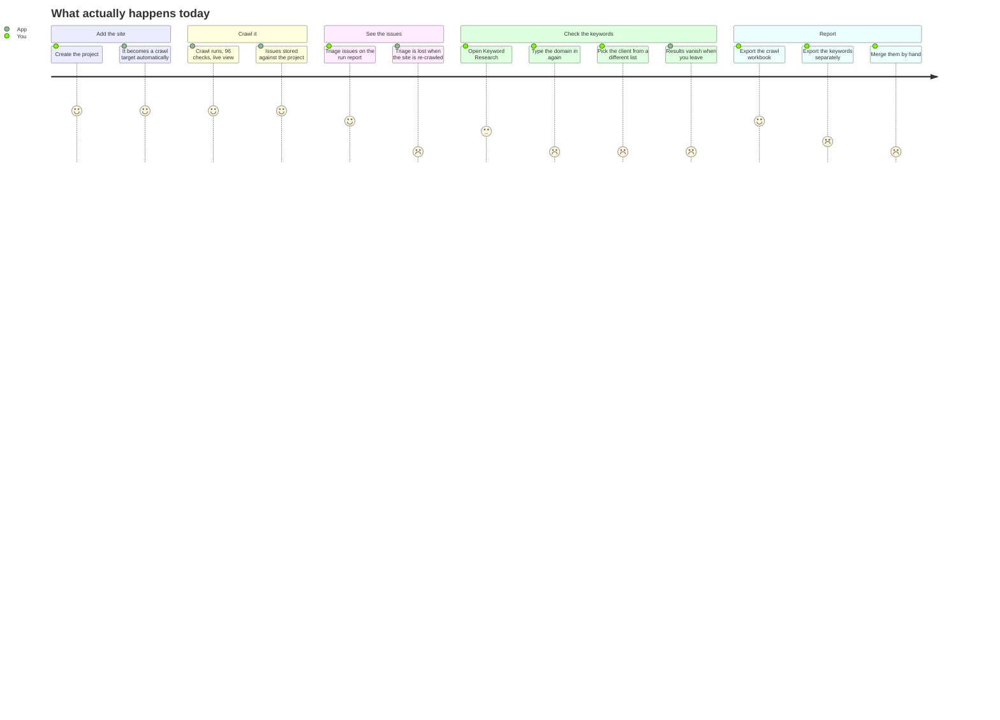

# How it connects today

## The map

```mermaid
graph TD
    subgraph CORE["THE SHARED CORE — one project, one database"]
        LOGIN["Login &amp; workspaces"]
        PROJ["The Project<br/>client + domains"]
        CRAWL["Site Crawler"]
        AIV["AI Visibility"]
        RUNS["Run History"]
        DASH["Project Dashboard"]
    end

    subgraph DISK["SAVES TO THE SERVER'S DISK — wiped on every deploy"]
        CARCH["Content Architect"]
        CTRACK["Competitor Tracker"]
        ONPAGE["On-Page Audit"]
        MKT["Market Potential"]
        ROBOTS["Robots Monitor"]
        KB["Knowledge Base"]
    end

    subgraph MEMORY["SAVES NOTHING — gone when you close the tab"]
        KWR["Keyword Research"]
        CRES["Content Research"]
        AREC["Article Recommendation"]
        AENH["Article Enhancement"]
        ALITE["Article Enhancer lite"]
        CENH["Content Enhancement"]
        IMG["Image Alt Tag Audit"]
        SGEO["SEO &amp; GEO Audit"]
        AGENT["Agent Readiness Audit"]
    end

    subgraph OWN["ITS OWN DATABASE, OUTSIDE OURS"]
        LPB["Location + Service Pages"]
    end

    DEAD["Competitor Analysis Report<br/>UNPLUGGED"]

    LOGIN --> PROJ
    PROJ --> DASH
    PROJ -- "same site record" --> CRAWL
    PROJ -- "same site record" --> AIV
    DASH -- "records every run" --> RUNS
    CRAWL -- "hands over its pages" --> CARCH
    DASH -- "starts and reads" --> CARCH
    DASH -- "starts and reads" --> CTRACK
    DASH -- "starts" --> SGEO
    DASH -- "starts" --> AGENT
    DASH -- "starts" --> AIV
    SGEO -- "opens it in a tab" --> ONPAGE
    KB -. "client name typed by hand" .-> KWR
    KB -. "client name typed by hand" .-> CRES
    KB -. "client name typed by hand" .-> AREC
    KB -. "client name typed by hand" .-> AENH

    style CORE fill:#e8f5e9,stroke:#2e7d32
    style DISK fill:#fff3e0,stroke:#e65100
    style MEMORY fill:#ffebee,stroke:#c62828
    style OWN fill:#f3e5f5,stroke:#6a1b9a
    style DEAD fill:#eceff1,stroke:#607d8b
```

**What to notice:** the green core is real and healthy — but the Project Dashboard reaches down into the orange box to start and read two tools whose data does not survive a deploy. Everything in the red box connects to nothing and keeps nothing.

---

## The seams — where two tools actually touch

There are **nine** real connection points today. Everything else is a coincidence of being in the same app.

| # | Seam | How they touch | Solid? |
|---|---|---|---|
| 1 | Site Crawler ↔ Project | They share the *same* client record. Adding a project makes a crawl target, and vice versa. | **Solid** |
| 2 | AI Visibility ↔ Project | AI Visibility runs against the project's domain and files its results as project runs. | **Solid** |
| 3 | Project ↔ Login and workspaces | Every read and write checks who you are and which workspace you are in. | **Solid** |
| 4 | Site Crawler → Content Architect | The dashboard can cluster the pages the crawl already found instead of re-crawling. This is the best thing in the codebase — one crawl, two answers. | **Solid** |
| 5 | Dashboard → SEO & GEO Audit | The dashboard calls the audit's own checker directly and stores the score against the project. | **Solid** |
| 6 | Dashboard → Agent Readiness Audit | Same pattern. | **Solid** |
| 7 | Dashboard → Content Architect's saved files | The dashboard reads and writes Content Architect's disk files. | **Fragile** — the files vanish on deploy |
| 8 | Dashboard → Competitor Tracker's saved files | The dashboard reads and writes Competitor Tracker's disk files. | **Fragile** — same reason |
| 9 | SEO & GEO Audit → On-Page Audit | The audit screen quietly starts the On-Page Audit and shows it in a tab. This is the only way a user reaches On-Page Audit at all. | **Fragile** — hidden, and the results vanish on deploy |

There is a tenth, weaker link: four writing tools pull a client's brand and industry notes from the Knowledge Base. But the client name is **typed by hand into each tool**, from a list written out five separate times. Rename a client and four tools silently stop finding its notes.

---

## The islands — tools that touch nothing

Ten tools have no connection to the project, to the crawl, or to each other.

| Island | Why it is isolated |
|---|---|
| Keyword Research | Its own keyword list, kept in memory, thrown away |
| Content Research | Its own scraper, its own brief, nothing stored |
| Article Recommendation | Its own scraper, its own brief, nothing stored |
| Article Enhancement | Its own fetcher, its own competitor research, nothing stored |
| Article Enhancer (lite) | Same, minus the competitor research |
| Content Enhancement | Its own fetcher; not in the menu at all |
| Image Alt Tag Audit | Its own scraper; workbook is downloaded and forgotten |
| Market Potential | Its own list of services and metros, on disk |
| Robots Monitor | Its own client list, its own schedule, its own Slack settings; not in the menu |
| Competitor Analysis Report | Unplugged — the screen is no longer wired to any address |

---

## One real journey, traced through the code

**The job:** *"Add gentledental.com, crawl it, see the issues, check the keywords, send the client a report."*

**What to notice:** the first half scores well and the second half collapses. The break is not the crawl — it is everything that should have followed from it.

**Where the journey breaks, precisely:**

1. **Adding the site works.** One form. It creates the client, the domain and the crawl schedule together. This part is genuinely unified.

2. **The crawl works.** It obeys robots.txt, paces itself, survives a restart, and can be paused and resumed. It is the strongest component in the app.

3. **The first break is triage.** You can mark an issue "confirmed" or "false positive". That decision is attached to *that one crawl run*. Re-crawl the site next week and every decision is gone — you triage the same 200 issues again. There is a durable recommendations list, but a crawl finding cannot be promoted into it.

4. **The second break is keywords.** Nothing carries over. You re-type the domain. You pick the client from a **different list** than the one in the header — one that was written out by hand in five places and has no connection to your projects. When you navigate away, the shortlist is gone; it was never written down.

5. **The third break is the report.** The crawl exports one workbook. Keywords export another. The AI visibility numbers are on a third screen. There is no single client report, and no way to say "everything we know about this site."

6. **The hidden break.** If your On-Page Audit results looked fine yesterday and are empty today, nobody did anything wrong — the app was deployed, and that tool's storage was erased. The same is true for Competitor Tracker, Market Potential, Robots Monitor, Content Architect and any Knowledge Base edit made through the app.

---

## The scale of the disconnection

| Question | Answer today |
|---|---|
| If I add a domain once, how many tools know about it? | 5 of 21 |
| If I crawl a site, how many tools can use that crawl? | 2 of 21 |
| If I close my laptop mid-job, how many tools remember? | 12 of 21 |
| If we deploy an update, how many tools lose data? | 6 |
| How many separate places must I look to see everything about one client? | At least 7 |

Next: [What's in the way](03-whats-in-the-way.md)
