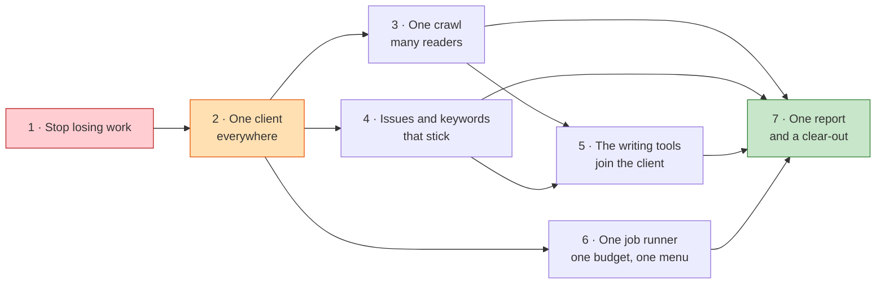

# The plan

Seven stages. Each one ships on its own and is useful on its own. Only **Stage 2** is a big bang; everything else can go out tool by tool.

**What to notice:** only Stage 1 blocks everything. After Stage 2, three tracks run in parallel — so more than one person can work at once.

---

## Stage 1 — Stop losing work

**What it unlocks:** everything. No other stage is safe until data survives a deploy.

**What changes for you:** nothing visible — and that is the point. Your client lists, competitor sets, page audits, market scenarios, monitoring history and Knowledge Base edits stop disappearing when we ship an update.

**What we do:** move all six disk-based tools and the Knowledge Base into the shared database. Move the nine "saves nothing" tools' results into a saved-results record so a run survives a restart.

**What could break:**
- Existing disk data must be carried over before the switch, or it is lost for good. **Take a copy of the server's data folders first.**
- The Project Dashboard reads two of these stores; if the move is half-done, its competitor and cluster cards go blank.
- Six tools currently work with no database at all; they will now need one, so a database outage takes them down too.

**Must be finished first:** nothing. This is the start.

**Size:** L · roughly 8–12 Claude Code sessions.

**How you'll know it worked:** add a competitor in Competitor Tracker, ask for a deploy, then reload. The competitor is still there. Do the same for a Knowledge Base edit, a market scenario, and a monitoring client.

**How to roll it back:** each tool moves independently and reads from the database with the old disk files still present. If one goes wrong, point that one tool back at its files and leave the rest.

---

## Stage 2 — One client, everywhere *(the one big bang)*

**What it unlocks:** every cross-tool feature. This is the stage that makes it one app.

**What changes for you:** the client you pick in the header now controls every screen. The four separate client lists disappear. Every tool opens already knowing the domain.

**What we do:** collapse the four rival client lists into the project record. Give every tool a client reference. Move identity checking to the front door instead of four places.

**What could break:**
- Existing records have no client attached. Each one must be matched to a project, and some will not match. **Expect a "needs assigning" list to work through by hand.**
- The Knowledge Base's six hardcoded client names must map onto real projects. If a name does not match, the writing tools lose that client's brand notes until it is mapped.
- The Location Pages tool has one client id typed into it. That must be replaced, and the tool tested against both of its pipelines.
- Anyone with a bookmark to a tool with no client selected needs a sensible landing screen.

**Must be finished first:** Stage 1.

**Size:** L · roughly 10–14 sessions. **Do this one in a single push, not spread over weeks** — a half-migrated client concept is worse than either end state.

**How you'll know it worked:** switch client in the header. Every screen you visit is about that client, with no typing. Then check the "needs assigning" list is empty.

**How to roll it back:** keep the old client lists in place, read-only, for one release. If it goes wrong, re-point the four tools at them.

---

## Stage 3 — One crawl, many readers

**What it unlocks:** speed, politeness, and six audits from one crawl.

**What changes for you:** audits get much faster and stop hammering the client's site. Run a crawl, then run five audits off it in seconds instead of minutes.

**What we do:** seven tools stop fetching pages themselves and read the crawl's stored pages. The remaining fetchers go through the crawler's fetching layer, so they finally obey robots.txt and pace themselves.

**Order — highest user value first:**

| Order | Tool | Why this order |
|---|---|---|
| 1 | On-Page Audit | Already half-joined to the audit screen; merging removes a duplicate outright |
| 2 | SEO & GEO Audit | The most-used audit; page history becomes possible |
| 3 | Content Architect | Already does this partly; finishing it deletes the second crawler |
| 4 | Image Alt Tag Audit | Biggest time saving — it currently re-scrapes 100+ pages every time |
| 5 | Agent Readiness Audit | Only needs site-level files, so it is the simplest |
| 6 | Content Enhancement | Small, but removes an unguarded fetcher |
| 7 | Article Enhancement (both) | Last, because articles are often not on the client's own site |

**What could break:**
- A stored page can be stale. Every screen must show when the crawl ran and offer "fetch fresh".
- Some tools accept a pasted page or an address outside the client's site. That path has to stay.
- The two crawlers behave slightly differently on redirects and address tidying, so cluster results may shift once.

**Must be finished first:** Stage 2.

**Size:** L overall, but **M per tool** and shippable one at a time · roughly 2–3 sessions per tool, 14–20 total.

**How you'll know it worked:** crawl a site once, then run the on-page audit, the alt-tag audit and the cluster analysis. None of them re-crawls, all finish in seconds, and the client's server log shows one visit, not four.

**How to roll it back:** each tool keeps its own fetcher behind a switch for one release. Flip it per tool.

---

## Stage 4 — Issues and keywords that stick

**What it unlocks:** triage that survives, and the end of re-typing keywords.

**What changes for you:**
- Mark an issue "won't fix" or "confirmed". Next week's crawl remembers. You stop re-triaging the same 200 issues.
- Turn any crawl finding into a recommendation with one click.
- Keyword Research saves its shortlist to the client. The audits, the page builder and the reports all read it.

**What we do:** give an issue a stable identity that outlives a single crawl. Widen the recommendations list to accept a crawl finding. Create one keyword list per client and point the three existing keyword homes at it.

**What could break:**
- Existing triage decisions are tied to old runs. They can be carried over, but only for the most recent crawl of each site.
- The page-builder's keyword tables are used live; they must be read from both places during the change.

**Must be finished first:** Stage 2.

**Size:** L · roughly 8–10 sessions.

**How you'll know it worked:** triage five issues, re-crawl the site, and confirm those five are still marked. Then run Keyword Research, close the tab, come back tomorrow, and the shortlist is on the client.

**How to roll it back:** the new issue identity is written alongside the old one for one release. Stop writing it and the old behaviour returns.

---

## Stage 5 — The writing tools join the client

**What it unlocks:** the whole content workflow, end to end, without re-typing anything.

**What changes for you:** Keyword Research, Content Research, Article Recommendation, both Article Enhancers and Content Enhancement all open knowing the client, the domain, the keywords and the brand voice. Their output is saved to the client and appears in the report.

**Order — highest user value first:**

| Order | Tool | Why |
|---|---|---|
| 1 | Content Research | Highest daily volume; the brief is the start of most work |
| 2 | Article Recommendation | Same job, next step; also lets us fold the two together later |
| 3 | Article Enhancement | High value per run, and expensive — worth saving |
| 4 | Article Enhancer (lite) | Mostly a copy of the one above; do them together if practical |
| 5 | Content Enhancement | Also fixes it being invisible in the menu |

**What could break:**
- These tools feed on the Knowledge Base by client name. Anything unmapped in Stage 2 shows up here as missing brand voice.
- Two of them are near-copies of each other; folding them together risks changing output for one group of users. **Keep both outputs available until users confirm.**

**Must be finished first:** Stages 3 and 4.

**Size:** M per tool · roughly 2 sessions each, 8–12 total.

**How you'll know it worked:** pick a client, open Content Research, and produce a brief without typing the client name or the domain. Find that brief on the client's page tomorrow.

**How to roll it back:** these tools keep working standalone throughout; the client link is additive. Turn it off per tool.

---

## Stage 6 — One job runner, one budget, one menu

**What it unlocks:** the ability to run more than one server, and to see what we are spending.

**What changes for you:**
- Long jobs stop dying when we deploy. Progress is accurate even if you close the tab.
- You can see what a client cost this month, and a run stops before it goes over budget.
- Robots Monitor and Content Enhancement appear in the menu. Nothing is reachable only by typing an address.

**What we do:** retire the second job queue. Move the four in-memory job registries into the database. One connection per data provider, with one shared cache and one budget checked before spending. One tool list drives the menu, the tabs, the run labels and the breadcrumb.

**What could break:**
- Moving a queue mid-flight can strand running jobs. **Do it during a quiet window and drain first.**
- One shared budget will start refusing runs that used to go through. Set the ceilings deliberately before switching it on.
- Combining the four caps that are all set to the same number will change effective limits.

**Must be finished first:** Stage 2. Can run alongside Stages 3–5.

**Size:** L · roughly 8–12 sessions.

**How you'll know it worked:** start a long crawl, ask for a deploy mid-run, and watch it resume. Then open the usage screen and see a single figure per client.

**How to roll it back:** the old queue stays present but idle for one release; the budget layer has an off switch.

---

## Stage 7 — One report, and a clear-out

**What it unlocks:** the thing clients actually see, and a codebase a new person can read.

**What changes for you:** one button produces one document covering everything the app knows about a client. You stop merging exports by hand.

**What we do:** one report layer that every tool contributes sections to. Then delete: the unplugged competitor screen, the dead tool catalogue, the unfinished team screens, the duplicate components, the 340 committed scraped pages, the contradictory status documents and the duplicate credential files.

**What could break:**
- Someone may rely on a specific existing export format. **Keep the old exports for one release** and check which are used.
- Deleting the scraped pages is permanent. Confirm nobody needs them.

**Must be finished first:** Stages 3, 4, 5 and 6 — the report can only be complete once the tools are.

**Size:** M · roughly 6–8 sessions.

**How you'll know it worked:** open a client, click "report", and send what comes out to a client without editing it.

**How to roll it back:** the report is additive. Deletions are one commit, revertable.

---

## Summary

| Stage | Size | Sessions | Ships alone? | Blocks |
|---|---|---|---|---|
| 1 · Stop losing work | L | 8–12 | Yes, per tool | Everything |
| 2 · One client, everywhere | L | 10–14 | **No — one push** | Stages 3–7 |
| 3 · One crawl, many readers | L | 14–20 | Yes, per tool | Stages 5, 7 |
| 4 · Issues and keywords that stick | L | 8–10 | Yes | Stages 5, 7 |
| 5 · Writing tools join the client | M×5 | 8–12 | Yes, per tool | Stage 7 |
| 6 · One job runner, budget, menu | L | 8–12 | Yes, in parts | Stage 7 |
| 7 · One report and a clear-out | M | 6–8 | Yes | — |
| **Total** | | **~62–88** | | |

---

## Every part, and where it is handled

All 21 tools and all 5 foundations appear in the plan. Nothing is left behind.

| Part | Stages that touch it |
|---|---|
| Project Dashboard | 2 (becomes the one client page), 4, 7 |
| Site Crawler | 3 (becomes the shared crawl), 4 (issue identity), 6 (its queue becomes the only queue) |
| AI Visibility | 2, 6 (its budget approach becomes the standard), 7 |
| SEO & GEO Audit | 1, 3, 4, 7 |
| Agent Readiness Audit | 1, 3, 7 |
| Run History | 6 (the eight run records become one), 7 |
| Content Architect | 1, 3, 7 |
| Location + Service Pages | 2 (loses its hardcoded client), 4 (keywords), 7 (report) |
| Knowledge Base | 1, 2 (client mapping), 5 |
| Competitor Tracker | 1, 2, 7 |
| On-Page Audit | 1, 3 (merges with SEO & GEO Audit), 7 |
| Market Potential | 1, 2, 7 (feeds the page builder) |
| Robots Monitor | 1, 2, 6 (gets a menu entry), 7 |
| Content Enhancement | 3, 5, 6 (gets a menu entry) |
| Keyword Research | 1, 4 (its shortlist becomes the client's), 5 |
| Content Research | 1, 5 |
| Article Recommendation | 1, 5 |
| Article Enhancement | 1, 3, 5 |
| Article Enhancer (lite) | 1, 3, 5 |
| Image Alt Tag Audit | 1, 3 |
| Competitor Analysis Report | 7 (export formats kept, rest deleted) |
| Login, workspaces and admin | 2 (identity moves to the front door) |
| Run history and the job runner | 6 |
| The look and feel | 7 |
| Buying outside data | 6 |
| Legacy scripts and scraped files | 7 (deleted) |

---

## What to stop building while this happens

| Stop | Until | Why |
|---|---|---|
| **New tools** | After Stage 2 | Every tool added now is a 22nd island to migrate later |
| **Anything that saves to disk** | After Stage 1 | It will be lost, and it will need moving twice |
| **New client lists** | After Stage 2 | We are removing four; do not add a fifth |
| **New fetchers, scrapers or crawlers** | After Stage 3 | There are already fifteen |
| **New export builders** | After Stage 7 | There are already thirty-one |
| **New component sets inside a tool folder** | After Stage 7 | There are already seven |
| **New background schedulers or queues** | After Stage 6 | There are already twelve |
| **New settings read straight from the environment** | After Stage 6 | 59 are already undocumented |

**Keep building:** anything inside the Site Crawler, AI Visibility and the Project Dashboard. Those three are on the spine and improving them compounds rather than adding debt.

Next: [Evidence](06-evidence.md) · [Open questions](07-open-questions.md)
